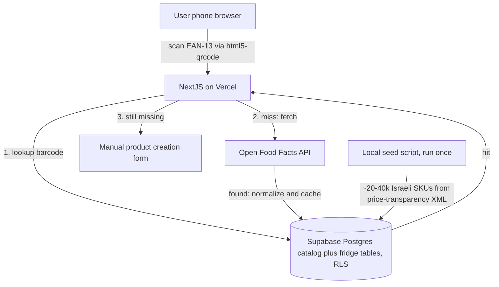

# Fridge Tracker — Assignment-Compliant Implementation Plan

Deadline: **September 6, 2026** (~3 weeks). Decision provenance is tagged [Assignment] / [Product] / [Recommendation].

## Stack and constraints [Assignment]

- Next.js (App Router) + TypeScript; Supabase for Postgres + Auth; Vercel deployment; public URL.
- 10 submission items: app link, repo link, product spec, technical design, test spec, test code, scalability doc, security doc, local setup + env vars, 10–15 min presentation.
- Docs are written before code (assignment stages 2–4). Small and solid beats big and unstable.

## Architecture [Recommendation, satisfies Assignment]

Single Next.js repo. Supabase is the only backend infrastructure; product data is served from our own catalog table, seeded offline.

- **Product data strategy** [Product idea, validated by research]: primary source = own `products` catalog seeded from Israel's Price Transparency XML files (EAN-13 barcode, Hebrew name, manufacturer, package size; legally public, no official API — seed via local script `scripts/seed-catalog.ts`, never at runtime). Fallback = Open Food Facts API (~8k IL products, free, ODbL — attribute it). Final fallback = manual entry. Cache OFF hits into the catalog.
- **Barcode scanning** [Product]: `html5-qrcode` in the browser (iOS Safari support; native BarcodeDetector is Chromium-only). Manual code entry + text search always available as fallback.
- **Categories** [Recommendation]: own fixed taxonomy (Dairy, Meat & Fish, Vegetables, Fruit, Drinks, Sauces, Snacks, Prepared, Frozen, Other), keyword auto-mapping from product names, user override. Transparency XML has no category field, so external-only categories are impossible.

## Data model (Supabase, all user tables under RLS)

- `products` — global catalog: `barcode` (unique, nullable), `name`, `brand`, `package_size`, `unit`, `category`, `image_url`, `source` ('seed'|'off'|'user'), `created_by`.
- `fridge_items` — one row per physical unit [Recommendation — matches "2 units, one half consumed"]: `user_id`, `product_id`, `remaining_percent` (0–100), `added_at`, `finished_at`.
- `consumption_events` — `fridge_item_id`, `user_id`, `delta_percent`, `created_at` — powers "recently consumed" and the restock summary.
- Derived logic: product is "low" when total remaining ≤ 25% of one unit (tunable), "finished" when previously stocked and now 0.

## Pages and API

- Pages: login/signup, Fridge (home, grouped by category), Add (scan / search / manual tabs), item Consume interaction (100/50/25/custom), Restock summary.
- Route handlers: `GET /api/products/lookup?barcode=`, `GET /api/products?q=` (paginated). Mutations via server actions. Zod validation on all inputs. [Assignment requires describing API + validation in the technical design doc.]

## Security and scalability story [Assignment]

- Supabase Auth (email/password), RLS on all per-user tables, service-role key server-side only, secrets in Vercel env vars, Zod at boundaries.
- Indexes: `products(barcode)` unique, trigram index on `products(name)` for Hebrew search, `fridge_items(user_id, finished_at)`. Pagination on catalog search. Server components to avoid over-fetching.
- Known free-tier risks to document: Supabase Free pauses after 1 week idle (unpause before grading); 500 MB DB cap (seed fits easily); Vercel Hobby cron = daily only (fine for stretch email digest).

## Scope tiers

- Core MVP: auth, scan/search/manual add, seeded Israeli catalog + OFF fallback, fridge inventory, fractional Consume, low/finished detection, in-app restock summary, categories.
- Stretch only: daily email digest (Vercel Cron + Resend), households/sharing, expiry dates, PWA.

## Open decisions for you (non-blocking)

- UI language: English UI with Hebrew product names rendered RTL-safe [Recommendation], or full Hebrew UI.
- Which chain(s) to seed from — decided by the spike results.

## Milestones

1. **M0 — Spike (days 1–2), gates everything:** download + parse one chain's PricesFull XML end-to-end; scan 10 real fridge products with html5-qrcode on your actual phone; probe those barcodes against OFF. Decide seed source + scanner library from evidence.
2. **M1 — Documents (days 2–5):** product spec, architecture, technical design in `docs/` (assignment stages 2–4).
3. **M2 — Skeleton (days 5–7):** Next.js + TS + Supabase Auth + RLS migrations; deploy to Vercel immediately; README env-vars section.
4. **M3 — Catalog (days 7–11):** schema + seed script + lookup chain (DB → OFF → manual) + search with pagination.
5. **M4 — Fridge core (days 11–16):** add flows incl. scanner UI, inventory view, Consume action, low/finished logic.
6. **M5 — Restock summary (days 16–17):** in-app "running low / finished since last visit" view.
7. **M6 — Tests (days 17–20):** test spec doc, Vitest unit tests (consumption math, lookup chain, validation), Playwright smoke E2E (login → add → consume → summary).
8. **M7 — Hardening + docs (days 20–22):** security doc, scalability doc, index/pagination review, RLS audit.
9. **M8 — Submission (days 22–23):** presentation deck, final README, repo cleanup; stretch email digest only if ahead of schedule.