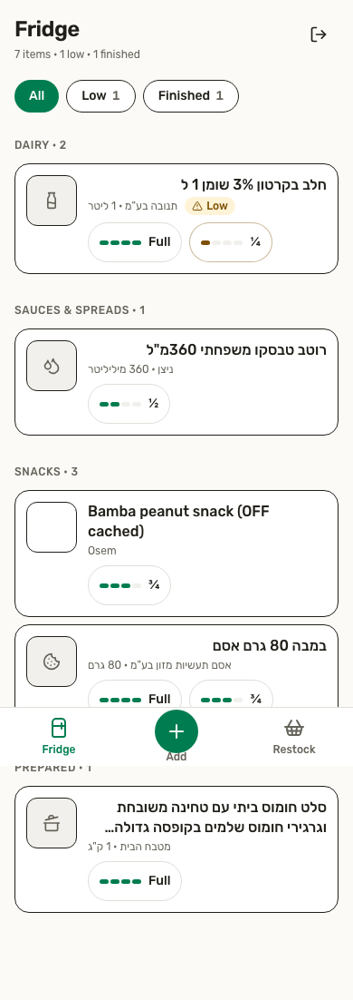
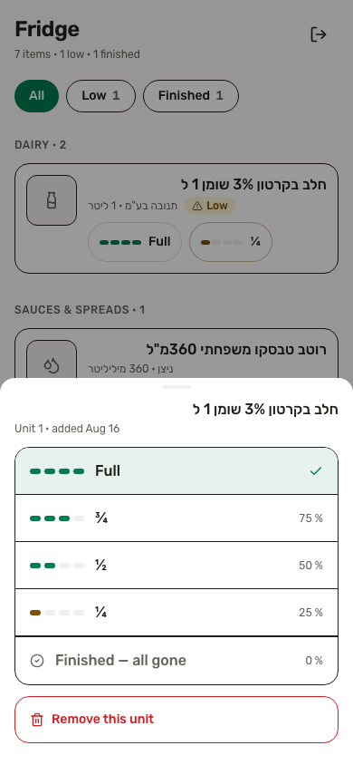
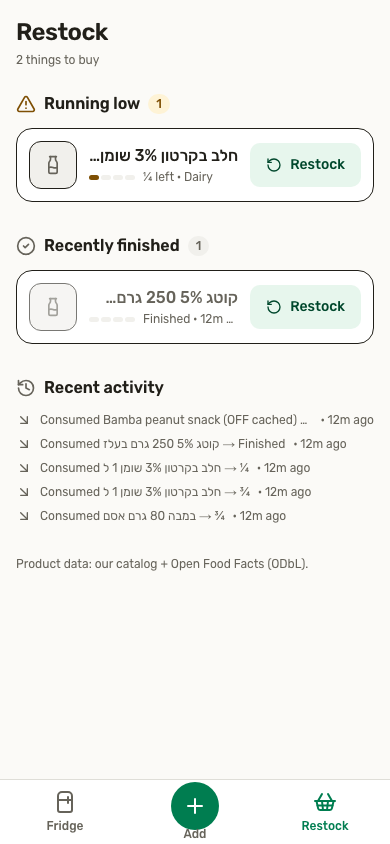

# Fridge Tracker

Know what is in your fridge and what to buy again — scan Israeli product
barcodes, track how much of each item is left (100/75/50/25/0%), and get a
restock list built from what actually ran out.

University Fullstack course final project.

**Live demo:** <https://fridge-tracker-delta.vercel.app>

## Documentation index

- [`docs/PRODUCT_SPEC.md`](docs/PRODUCT_SPEC.md) — what we're building and why
- [`docs/ARCHITECTURE.md`](docs/ARCHITECTURE.md) — system components and data flow
- [`docs/TECHNICAL_DESIGN.md`](docs/TECHNICAL_DESIGN.md) — schema, contracts, flows
- [`docs/UI_DESIGN.md`](docs/UI_DESIGN.md) — screens, components, interaction design
- [`docs/IMPLEMENTATION_PLAN.md`](docs/IMPLEMENTATION_PLAN.md) — wave-by-wave build plan
- [`docs/FEATURES_V2_PLAN.md`](docs/FEATURES_V2_PLAN.md) — V2 foundation (schema, RLS, frozen contracts, F1/F2/F3 ownership)
- [`docs/RESTOCK_REMINDERS.md`](docs/RESTOCK_REMINDERS.md) — F2 reminders: Edge Function worker, Brevo email, cron deployment runbook
- [`docs/TEST_SPEC.md`](docs/TEST_SPEC.md) — automated and manual test strategy + evidence
- [`docs/SECURITY.md`](docs/SECURITY.md) — trust boundaries, RLS audit, verified attack matrix
- [`docs/SCALABILITY.md`](docs/SCALABILITY.md) — measured query plans, growth analysis, scaling path
- [`docs/presentation/SLIDES.md`](docs/presentation/SLIDES.md) — presentation deck (10–15 min)
- [`docs/presentation/DEMO_SCRIPT.md`](docs/presentation/DEMO_SCRIPT.md) — timed live-demo script + fallbacks

## Status: submission-ready MVP

All five implementation waves are complete. The full flow works end to end:
camera scan → barcode normalization/classification → local catalog lookup →
Open Food Facts fallback → product confirmation → add units to the fridge →
consume (Full → ¾ → ½ → ¼ → Finished) → restock. Also implemented: catalog
text search, manual product entry (the fallback for unknown/store-internal
barcodes), the restock page (running low · finished recently · recent
activity), and a ~7,490-product seeded Israeli catalog
(`data/catalog-seed.csv`, Shufersal price-transparency data).

Verified on a local Supabase stack (Docker) with the full migration chain, and
re-verified 2026-08-17 against the hosted Supabase project (Frankfurt) and the
production Vercel deployment:

- 318 Vitest unit/integration tests passing
- 9/9 Playwright E2E tests passing against the **hosted** Supabase project and
  again 9/9 against the **production URL** (auth boundaries, full fridge
  lifecycle, barcode edge cases, catalog search, cross-user RLS attack matrix)
- hosted catalog seeded: 7,490 products; Bamba `7290000066318` resolves from
  the seeded catalog
- production smoke: `/login`, `/signup`, `/scan-test` 200; logged-out
  `/fridge`, `/add`, `/restock` redirect to `/login`;
  `/wasm/zxing_reader.wasm` served from the app origin (`application/wasm`)
- lint, typecheck, production build: clean
- responsive QA at 390×844 / 430×932 / 768×1024 / 1440×900: no defects

The remaining manual item is the physical-phone camera test in
`docs/TEST_SPEC.md` §9 (real iPhone Safari / Android Chrome).

## Screenshots

| Fridge (mobile)                                  | Consume sheet                                            | Restock                                            |
| ------------------------------------------------ | -------------------------------------------------------- | -------------------------------------------------- |
|  |  |  |

Desktop layout: [`docs/screenshots/fridge-desktop.png`](docs/screenshots/fridge-desktop.png).

## Main features

- **Barcode scanning** in the browser (rear camera, HTTPS) with a self-hosted
  ZXing WASM decoder — no runtime CDN dependency
- **Israeli-first product resolution:** normalized GTIN → seeded local catalog
  (~7,490 Shufersal products) → Open Food Facts fallback → manual entry;
  store-internal/weighed (RCN `2xx…`) codes get dedicated guidance
- **Quarter-step consumption** per physical unit (Full/¾/½/¼/Finished) with
  undo, per-unit history, and low/finished derivation
- **Restock list** driven by what actually ran out: running-low, recently
  finished (one-tap restock to a fresh 100% unit), and a recent-activity feed
- **Per-user isolation enforced in the database** (Supabase RLS) — verified
  empirically with a cross-user attack matrix
- Hebrew/RTL product names, mobile-first UI with bottom navigation, desktop
  top navigation

## Stack

Next.js 16 (App Router) · TypeScript (strict) · Tailwind CSS v4 · Supabase
(Postgres + Auth, `@supabase/ssr`) · Zod v4 ·
`@yudiel/react-qr-scanner` (barcode-detector + zxing-wasm) · Vitest ·
Playwright · ESLint · Prettier · Vercel. UI primitives, icons (Lucide glyphs),
and toasts are small in-repo components — no shadcn/sonner/lucide-react
packages.

**Architecture in one paragraph:** a Next.js app (server components + a few
server actions and route handlers) talks to Supabase Postgres through the
anon-key client; every table has Row Level Security, so the database — not the
web tier — is the authorization boundary. The barcode pipeline runs fully
client-side (camera → WASM decode → normalize/classify) and only the resolved
GTIN hits the API. Details and diagrams: `docs/ARCHITECTURE.md`.

## Local setup

Prereqs: Node 20.9+ (CI uses 22), npm, and a free
[Supabase](https://supabase.com) project (hosted, or the local CLI stack).

```bash
npm install
cp .env.example .env.local   # then fill in the values, see below
npm run dev                  # http://localhost:3000
```

### 1. Supabase project configuration

1. Create a project at [database.new](https://database.new) (choose an EU
   region, e.g. Frankfurt, to match the Vercel function region in
   `vercel.json`).
2. In **Project Settings → API**, copy the Project URL and the `anon` public
   key into `.env.local`:
   - `NEXT_PUBLIC_SUPABASE_URL`
   - `NEXT_PUBLIC_SUPABASE_ANON_KEY`
3. In **Authentication → Sign In / Providers → Email**, disable
   **"Confirm email"** (approved MVP demo behavior: signup logs you in
   immediately). For a real production launch you would instead keep email
   confirmation on and configure reliable SMTP — see `docs/SECURITY.md` §4.

The `SUPABASE_SERVICE_ROLE_KEY` is used ONLY by the local catalog seed script
(step 3) — it must never be committed or set on Vercel.

### 2. Apply the database migrations

There are four migrations, applied in filename order:

| Migration                               | What it does                                                           |
| --------------------------------------- | ---------------------------------------------------------------------- |
| `20260815000000_initial_schema.sql`     | tables, indexes, RLS policies                                           |
| `20260816000000_security_hardening.sql` | consumption-event ownership policy + `image_url` CHECK (Wave 5 fix)   |
| `20260816000100_data_api_grants.sql`    | explicit Data API grants (required on Supabase projects created ≥ 2026) |
| `20260818000000_v2_foundation.sql`      | V2 lineage FK, reminder/notification/AI tables + RLS (see `docs/FEATURES_V2_PLAN.md`) |

Option A — Supabase CLI (recommended):

```bash
supabase init            # creates supabase/config.toml (not committed)
supabase link --project-ref <your-project-ref>
supabase db push         # applies supabase/migrations/*.sql in order
```

Option B — dashboard: open the SQL Editor and run the contents of each file in
`supabase/migrations/`, in filename order, once each.

Afterwards, **Database → Tables** should show `products`, `fridge_items`, and
`consumption_events`, each with RLS enabled. After the V2 foundation
migration, also `restock_reminders`, `notifications`, `ai_conversations`,
`ai_messages`, and `ai_action_proposals`. The MVP UI does not use those
tables until agents F1–F3 implement their features.

### 3. Seed the Israeli catalog

Set `SUPABASE_SERVICE_ROLE_KEY` in `.env.local` (Project Settings → API →
`service_role` key), then:

```bash
npm run seed:db   # upserts data/catalog-seed.csv (~7,490 products)
```

The committed CSV was built from Shufersal's statutory price-transparency
files; `npm run seed:fetch` regenerates it (needs access to the Israeli
portal and is never required for grading — the CSV is committed).

### 4. Verify

Sign up at `/signup`, land on the (empty) `/fridge`. Logged-out visits to
`/fridge`, `/add`, or `/restock` redirect to `/login`. On `/add`, searching
"במבה" should hit the seeded catalog, and scanning/typing barcode
`7290000066318` should resolve without calling Open Food Facts.

## Scripts

```bash
npm run dev          # dev server (auto-syncs the scanner WASM binary first)
npm run build        # production build (same auto-sync)
npm run lint         # ESLint
npm run typecheck    # tsc --noEmit
npm test             # Vitest (single run; same auto-sync)
npm run test:watch   # Vitest (watch)
npm run test:e2e     # Playwright (credential-gated tests skip when unconfigured)
npm run test:e2e:ui  # Playwright interactive runner
npm run seed:db      # seed/upsert the product catalog into Supabase
npm run seed:fetch   # regenerate data/catalog-seed.csv from the retailer portal
npm run wasm:sync    # manually copy zxing_reader.wasm into public/wasm/
npm run format       # Prettier (write)
npm run format:check # Prettier (check)
```

## Testing

- **Unit/integration (Vitest):** 354 tests across barcode normalization and
  classification, product lookup/search, fridge derivations, schema
  validation, server-action logic, API contracts, and V2 foundation contracts
  (`src/lib/v2/`).
- **E2E (Playwright):** 8 tests. Three run credential-free (auth boundaries,
  responsive shell); five need dedicated Supabase test users supplied via
  env vars (full lifecycle, barcode edge cases, catalog search, and the
  cross-user RLS attack matrix, including the Wave 5 event-ownership fix).
- **Test-credential policy:** two dedicated throwaway users
  (`fridge-e2e-a@…`, `fridge-e2e-b@…`) created only for testing. Credentials
  live in `.env.local` / CI secrets — never in the repository. See
  `.env.example` for the variable names and `docs/TEST_SPEC.md` for the
  full matrix and evidence record.

CI (`.github/workflows/ci.yml`) runs lint, typecheck, unit tests, and the
credential-free Playwright auth-boundary checks on every push and pull
request.

## Deployment (Vercel)

1. Push this repo to GitHub and import it in Vercel (framework preset:
   Next.js — no custom build settings needed; `prebuild` syncs the scanner
   WASM binary automatically). Production branch: `main`.
2. Set two environment variables in the Vercel project (Production +
   Preview): `NEXT_PUBLIC_SUPABASE_URL` and `NEXT_PUBLIC_SUPABASE_ANON_KEY`.
   Do **not** set the service-role key on Vercel.
3. Deploy. `vercel.json` pins the function region to `fra1` (Frankfurt) so
   server code runs next to an EU Supabase project (single-region choice is
   supported on the Hobby plan).
4. Smoke-test the deployed origin: `/login`, `/signup`, `/fridge` (redirects
   when logged out), `/add`, `/restock`, `/scan-test`, and
   `https://<your-app>/wasm/zxing_reader.wasm` (the self-hosted decoder must
   be served from your own origin). Camera scanning requires HTTPS, which
   Vercel provides by default — verify `/add` → Scan → "Enable camera" on a
   real phone.

### Supabase keep-alive (grading window)

Free-plan Supabase projects pause after ~7 days without database activity.
`.github/workflows/supabase-keepalive.yml` pings the project twice a week
(sign-in as a dedicated test user + a 1-row catalog read; no service-role
key). It is a no-op until these repository secrets are configured:
`KEEPALIVE_SUPABASE_URL`, `KEEPALIVE_SUPABASE_ANON_KEY`, `KEEPALIVE_EMAIL`,
`KEEPALIVE_PASSWORD`.

## Demo barcodes

Known-good codes for a live demo (all present in the committed catalog and
verified against a fully seeded database):

| Barcode         | Product                            | Path exercised                       |
| --------------- | ---------------------------------- | ------------------------------------ |
| `7290000066318` | במבה 80 גרם אסם (Bamba)            | seeded catalog hit                   |
| `7290004131074` | חלב בקרטון 3% שומן 1 ל (Tnuva milk) | seeded catalog hit                   |
| `0011210000032` | Tabasco 60ml                        | seeded catalog hit with leading zero |
| `2000000000008` | (store-internal RCN)                | weighed-item guidance → manual entry |
| `1234567890123` | (bad check digit)                   | invalid-code error message           |

An imported EU product from your kitchen typically demonstrates the Open Food
Facts fallback; it is intentionally not scripted because it depends on live
OFF availability (the seeded catalog is the reliable demo path).

## Known limitations

- Quarter-step estimates only — no weights/volumes or expiry dates (out of
  MVP scope; see `docs/PRODUCT_SPEC.md` §9).
- Single-user fridges — no household sharing.
- One seeded retail chain (Shufersal); coverage of niche products relies on
  the Open Food Facts fallback or manual entry.
- Camera scanning requires a browser with `BarcodeDetector`/WASM support and
  HTTPS; iOS Safari needs a user gesture to start the camera.
- Email confirmation is disabled for demo reliability (documented decision;
  production recommendation in `docs/SECURITY.md` §4).

## Attribution

- Product fallback data: [Open Food Facts](https://openfoodfacts.org),
  licensed under the
  [Open Database License (ODbL)](https://opendatacommons.org/licenses/odbl/1-0/).
  The UI credits OFF wherever fallback data is shown.
- Seeded catalog: derived from Shufersal's statutory Israeli
  price-transparency publications.
- Barcode decoding: [zxing-wasm](https://github.com/Sec-ant/zxing-wasm)
  (self-hosted binary, synced at build time).

## Project structure

```
src/
  app/                  # App Router: (auth) login/signup, (app) fridge/add/restock, api/, scan-test
  components/
    app-shell/          # top bar, bottom nav, toaster
    fridge/             # inventory, add flow (scan/search/manual), restock components
    scanner/            # BarcodeScanner island, state machine, UPC-E expansion, WASM config
    ui/                 # hand-vendored shadcn-style primitives (button, input, badge, modal, skeleton)
  lib/
    types.ts            # FROZEN shared domain + contract types
    schemas.ts          # FROZEN Zod boundary schemas
    routes.ts           # FROZEN route map + gating predicates
    v2/                 # V2 frozen contracts + stub actions (docs/FEATURES_V2_PLAN.md)
    barcode/            # GTIN domain: normalize · check digit · classify (RCN)
    products/           # lookup chain, search, Open Food Facts client, categorization
    fridge/             # derivations (low/finished/activity), formatting, mappers, queries
    actions/            # server actions (fridge CRUD, manual product)
    supabase/           # server / browser / proxy-session clients
  proxy.ts              # session refresh + route gating (Next 16 network boundary)
e2e/                    # Playwright suites (auth boundaries, journeys, RLS matrix)
scripts/                # catalog fetch/seed + WASM sync
data/catalog-seed.csv   # committed Israeli catalog (~7,490 products)
supabase/migrations/    # schema + RLS + Wave 5 hardening (reviewable SQL)
docs/                   # all design/test/security/scalability docs + presentation
```
