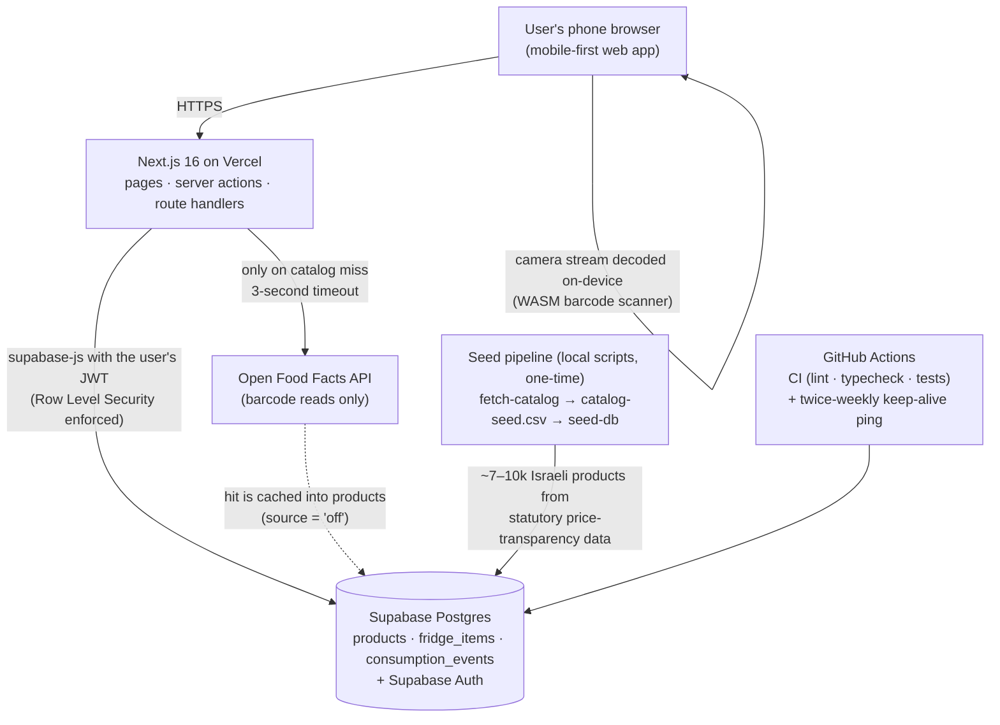
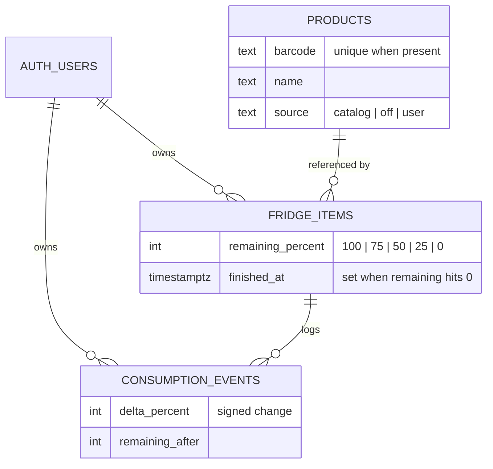
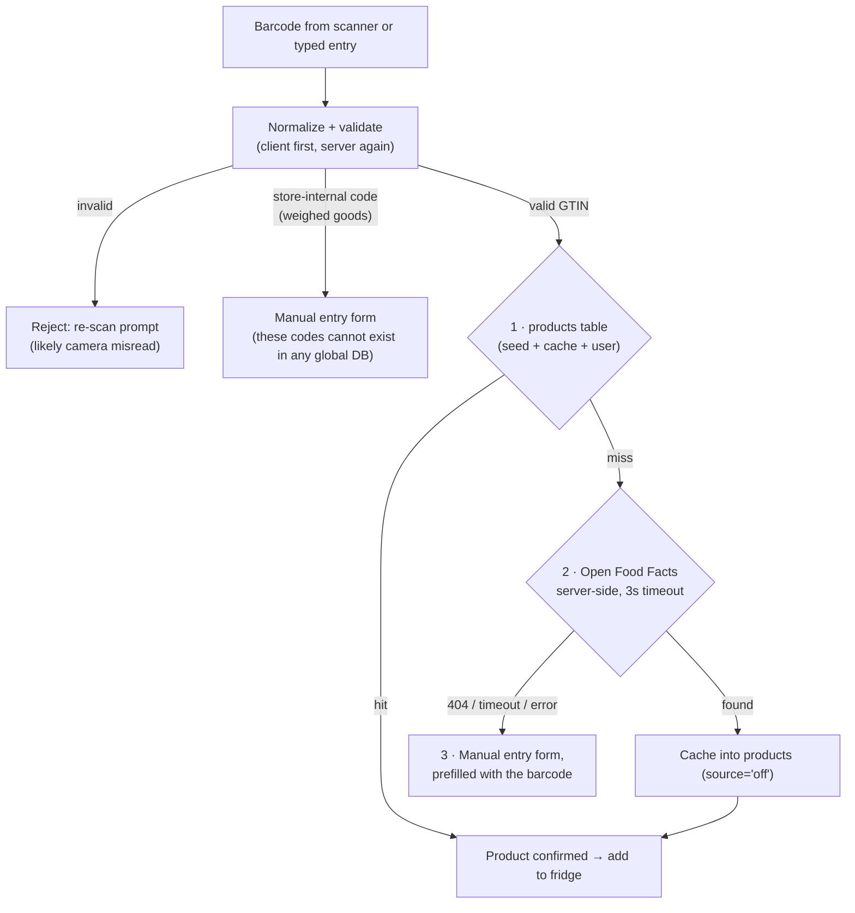
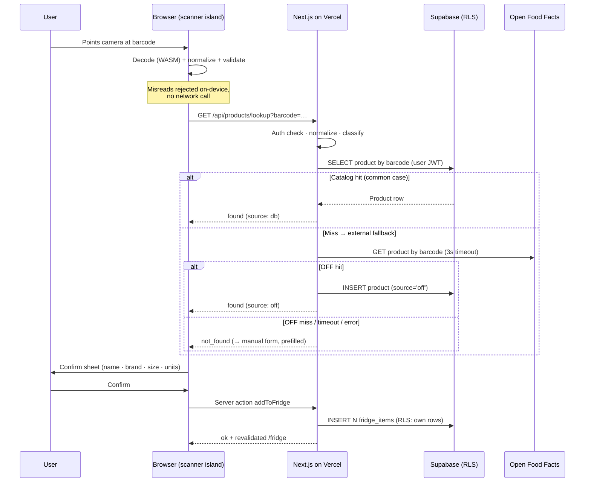
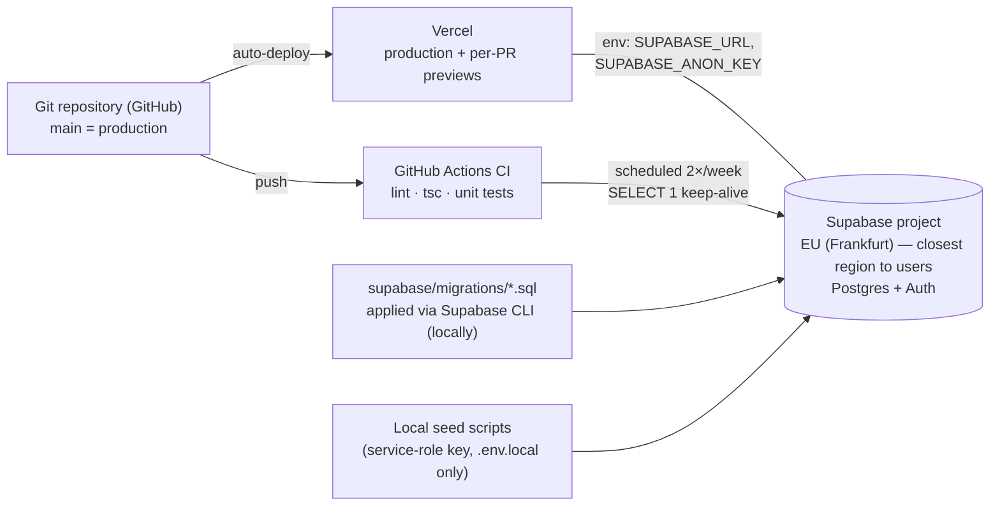

# Fridge Tracker — Software Architecture

| | |
|---|---|
| **Course** | Internet Technologies — Become a Full-Stack Engineer (RUNI CS 2026, final assignment) |
| **Document role** | Assignment stage 3 — software architecture design |
| **Status** | Historical MVP architecture (written before any application code, per the assignment's required work order) + V2 addendum below. The V2 runtime adds: a Supabase Edge Function reminder worker driven by pg_cron/pg_net (5-minute tick, Brevo email adapter — see `docs/RESTOCK_REMINDERS.md`), and a provider-neutral AI chat backend (Gemini `gemini-2.5-flash` → Groq `openai/gpt-oss-120b` failover behind server-only keys — see `docs/FEATURES_V2_PLAN.md` §13 and `docs/SECURITY.md` §22/§24). Both were deployed and verified against the hosted project on 2026-08-19/20. |
| **Date** | 2026-08-15 |
| **Companion documents** | `docs/PRODUCT_SPEC.md` (stage 2 — what we build and why), `docs/TECHNICAL_DESIGN.md` (stage 4 — detailed design: schemas, contracts, components) |

---

## 1. Architecture Overview

Fridge Tracker is a **single Next.js application** deployed on Vercel, with **Supabase** as the only runtime infrastructure (Postgres database + authentication) and **Open Food Facts** as the only external API — called server-side, and only when a scanned barcode is missing from our own catalog.

There is deliberately **no separate backend service**: the Next.js server runtime (server components, server actions, and route handlers) *is* the backend. Section 12 lists everything this architecture deliberately does not contain, and why.

## 2. Technology Stack and Why

| Layer | Choice | Rationale |
|---|---|---|
| Framework | **Next.js 16 (App Router) + TypeScript (strict)** | Mandated by the assignment. The App Router provides server components (reads), server actions (mutations), and route handlers (JSON APIs) in one codebase — exactly the shape the assignment names ("API routes or server actions"). 16.x was the current stable major at planning time (verified 2026-08-14). |
| Hosting | **Vercel** (Hobby tier) | Mandated. First-class Next.js runtime; preview deployments per branch; HTTPS by default (required for camera access via `getUserMedia`). |
| Database | **Supabase Postgres** | Mandated. A real relational database fits the data model (shared catalog referenced by per-user rows); Postgres additionally provides trigram indexing for Hebrew-compatible name search and Row Level Security for authorization. |
| Authentication | **Supabase Auth** (email + password) | Explicitly permitted by the assignment. Password hashing, session issuance, and token refresh are handled by Supabase's auth server; sessions live in httpOnly cookies via `@supabase/ssr`. Minimal custom code, and it integrates directly with RLS. |
| Authorization | **Row Level Security (RLS) on every table** | The single enforcement point for data ownership: every query runs with the calling user's JWT, so even a buggy server action cannot read or write another user's rows. |
| Styling / UI | **Tailwind CSS + hand-vendored shadcn-style primitives + a small custom toast component** | Mobile-first utility styling. The UI primitives (`button`, `input`, `badge`, `modal`, `skeleton`) are written in-repo following the shadcn/ui conventions and design tokens rather than installed as packages, icons are vendored Lucide SVGs (`src/components/icons.tsx`, ISC-attributed), and toasts are a ~100-line React-context component (`app-shell/Toaster.tsx`) instead of sonner — the assignment requires being able to explain every component, and owned code is fully readable. No Radix/shadcn/sonner/lucide-react packages are installed. |
| Barcode scanning | **`@yudiel/react-qr-scanner`** (wrapping the `barcode-detector` ponyfill over `zxing-wasm`) | Scanning runs **in the browser** — the camera stream never leaves the device. This library stack was chosen after verification (2026-08-14) that: the native `BarcodeDetector` API is unavailable on iOS Safari, and the previously considered `html5-qrcode` is officially unmaintained. The WASM decoder works on all modern mobile browsers; the WASM binary is self-hosted from our origin (`public/wasm/`, synced from the installed package by `scripts/sync-zxing-wasm.mjs`) to avoid a CDN dependency during the demo. |
| Validation | **Zod** | One schema source shared by server actions, route handlers, forms, and tests. |
| Testing | **Vitest** (318 unit/integration tests) + **Playwright** (8 E2E tests, Chromium) | The assignment's sanctioned toolset. Vitest covers the barcode domain, lookup chain, actions, derivations, and schemas; Playwright covers auth boundaries, the full fridge lifecycle, barcode edge cases, catalog search, and the two-user RLS attack matrix (React Testing Library ended up unnecessary — component behavior is covered by the E2E journeys). See `docs/TEST_SPEC.md`. |
| CI | **GitHub Actions** | Lint, typecheck, and unit tests on every push; also a scheduled twice-weekly database ping (see §11, free-tier pause mitigation). |

## 3. System Components

### 3.1 Runtime components (the deployed app)

| Component | Technology | Responsibility |
|---|---|---|
| **Pages (server components)** | Next.js RSC | All page-level reads. Each page fetches its own data on the server with a cookie-bound Supabase client and renders HTML. No client-side data fetching for page content. |
| **Server actions** | Next.js server actions in `src/lib/actions/` | **All mutations**: add to fridge, set remaining level, delete item, restock item, create manual product. Each action: auth check → Zod validation → database write (under RLS) → `revalidatePath` so affected pages re-render. |
| **Route handlers** | `src/app/api/products/lookup`, `src/app/api/products/search` | The only two JSON read APIs, used by client components during the add flow: barcode lookup (resolution chain, §6) and paginated catalog text search. |
| **Domain modules** | Plain TypeScript in `src/lib/barcode/`, `src/lib/products/`, `src/lib/fridge/` | Framework-free business logic: barcode normalization/validation/classification; the product lookup chain and Open Food Facts client; fridge derivations (low/finished, grouping, restock summary). Imported by actions, handlers, and pages; unit-testable without mocking Next.js. |
| **Scanner component** | Client component in `src/components/scanner/` | Isolated client island wrapping the barcode scanner library: camera permission states, detection, torch toggle, and an always-available typed-code fallback. Emits detected codes to the add flow. |
| **Middleware** | `src/middleware.ts` | Refreshes the Supabase session cookie on every request and gates protected routes (`/fridge`, `/add`, `/restock`, `/api/*`); `/login` and `/signup` are public. |
| **Supabase clients** | `src/lib/supabase/` | Thin factories: a cookie-bound server client (pages/actions/handlers) and a browser client (auth forms). Both use only the **anon key**; there is no service-role key anywhere at runtime. |

### 3.2 Offline components (run locally, never deployed)

| Component | Responsibility |
|---|---|
| **`scripts/fetch-catalog.ts`** | One-time: downloads 2–3 full price files from Shufersal's statutory price-transparency portal, parses the XML, filters out weighed-goods rows and codes failing GTIN validation, dedupes by barcode, applies keyword→category mapping, and writes `data/catalog-seed.csv` (committed to the repo so graders can seed without access to Israeli retail portals). |
| **`scripts/seed-db.ts`** | Loads the committed CSV into the `products` table. This is the **only** code that uses the Supabase service-role key, from a local `.env.local` only. Idempotent (upsert on barcode). |

## 4. Pages

Five routes, mobile-first:

| Route | Access | Purpose |
|---|---|---|
| `/login`, `/signup` | Public | Email + password auth forms. Middleware redirects unauthenticated users of protected pages here. |
| `/fridge` | Authenticated | Home. Inventory grouped by category; per-unit remaining-level chips; one-tap consume control; delete; filter tabs (All / Low / Finished). |
| `/add` | Authenticated | Three tabs — **Scan** (camera), **Search** (debounced, paginated catalog search), **Manual** (short form) — each ending in a units count and a confirm. |
| `/restock` | Authenticated | Running-low list, finished-recently list (last 14 days, not yet restocked), recent-activity feed, one-tap "Restocked". |

## 5. Data Model (entity level)

Three application tables plus Supabase-managed `auth.users`. Full column-level schema, constraints, indexes, and RLS policies are specified in `docs/TECHNICAL_DESIGN.md` §3.

The model separates **shared reference data** from **per-user state** — the load-bearing distinction of the whole design:

- **`products` — shared catalog (read by all authenticated users).** One row per barcode (or per manual product). Three provenances, recorded in a `source` column: `'catalog'` (seeded from Israeli price-transparency data), `'off'` (cached Open Food Facts hits), `'user'` (manual creations). The same product row serves every user; the catalog grows organically from use.
- **`fridge_items` — per-user, one row per physical unit.** "Two milk cartons, one half-finished" is two rows (100 and 50). Owned by exactly one user; invisible to everyone else.
- **`consumption_events` — per-user append-only log.** One row per consume action (signed delta + resulting level). Powers the recent-activity feed on the restock page.

## 6. Product Identification Architecture

The most consequential design in the system. A scanned or typed barcode resolves through a three-step chain, ordered so that the common case never leaves our infrastructure:

Why each layer exists:

1. **Local seeded catalog (primary).** Israel's food-sector law obliges large retailers to publish machine-readable product/price files, and grants everyone free reuse — including commercial — by statute (§30(e); verified against the statutory text in `docs/research/ISRAELI_RETAIL_DATA.md`). One large chain's files yielded ~6.5–7.5k products per store with ~97% real GTIN barcodes when probed during research. Seeding these into our own table gives instant, dependency-free resolution for the products Israelis actually buy — and perfect demo reliability.
2. **Open Food Facts (runtime fallback).** A free, keyless, open-licensed (ODbL) community database. Research measured strong coverage exactly where a consumer app needs it first: 9 of 10 iconic Israeli staples resolved, with Hebrew names and photos, at ~300 ms median read latency — while its *search* layer proved unreliable in the same tests. Consequently OFF is used **only for barcode reads, never search**, server-side, with a 3-second timeout, and every hit is cached permanently into `products` so any product is fetched externally at most once across all users. Attribution is rendered in the app footer and README per ODbL.
3. **Manual entry (final fallback).** Prefilled with the scanned barcode; the created product joins the shared catalog. Guarantees the user is never blocked.

Failures **degrade, they never block**: an OFF outage or timeout is treated as "not found" and routes to manual entry; the demo never depends on OFF being up because demo products are in the seed.

## 7. Roles and Permissions

**Exactly one role: authenticated user.** There are no admins, moderators, or guests; there is no roles table and no permission matrix in application code.

- **Authentication** answers "who are you": Supabase Auth sessions in httpOnly cookies, refreshed by middleware; unauthenticated requests are redirected (pages) or rejected with 401 (API).
- **Authorization** answers "what may you touch," and is enforced **in the database** by RLS policies: users read the shared catalog and may insert into it (their own manual/cached products); users can only see and modify `fridge_items` and `consumption_events` rows where `user_id = auth.uid()`. The policy-by-policy breakdown is in `docs/TECHNICAL_DESIGN.md` §3.4.

A consequence worth stating explicitly: the Supabase **anon key is public by design** (it ships to the browser). It grants nothing by itself — every row-level grant comes from RLS evaluated against the user's JWT. The service-role key, which bypasses RLS, exists only in the local seed script's environment and is never deployed.

## 8. Main Data Flows

### 8.1 Page read (e.g., opening `/fridge`)

Browser → Vercel: the server component authenticates from the session cookie, queries Supabase with the user's JWT (RLS filters to their rows), joins fridge items to catalog products, groups by category, and returns rendered HTML. No client-side fetching, no loading spinners for primary content.

### 8.2 Mutation (e.g., consuming a unit)

Client island → server action: the action checks auth, Zod-parses the input, performs the write under RLS (update item + insert consumption event), calls `revalidatePath`, and returns a typed result. The UI shows the change optimistically and reconciles when the action returns.

### 8.3 Add-by-scan (the full chain)

### 8.4 Catalog seeding (offline, one-time)

Local script → retailer portal → committed CSV → local seed script → `products` table (service-role key, local only). Runs before launch; never at request time; never from Vercel.

## 9. External Dependencies and Why Each Exists

Runtime dependency surface is deliberately minimal — two platforms, one external API, and a short list of libraries, each individually justified:

| Dependency | Type | Why it exists | Cost / license / risk notes |
|---|---|---|---|
| Supabase | Platform (DB + auth) | Mandated; Postgres + Auth + RLS as described above | Free tier; pauses after ~1 week of inactivity — mitigated by a scheduled keep-alive ping (§11) |
| Vercel | Platform (hosting) | Mandated; Next.js runtime + HTTPS (camera requires a secure context) | Hobby tier limits are ample for this workload |
| Open Food Facts API | External API (fallback only) | Israeli-staples coverage with Hebrew names/photos, free and keyless; used only on catalog miss, cached forever | ODbL: attribution rendered in footer/README; share-alike obligations acknowledged for cached rows. Rate limits respected by design (cache-miss calls only). Requires only a User-Agent string — a constant, not a secret |
| Israeli price-transparency files (Shufersal portal) | External data source (offline seed) | Primary catalog: statutory, legally free for any use incl. commercial (Food Law §30(e)) | Fetched once, locally, from an Israeli network; the resulting CSV is committed so nobody else ever needs portal access |
| `@supabase/supabase-js` + `@supabase/ssr` | Library | Official client + cookie-session integration for App Router | — |
| `@yudiel/react-qr-scanner` (+ `barcode-detector`, `zxing-wasm`) | Library | Cross-browser in-browser scanning incl. iOS Safari (verified: native BarcodeDetector unavailable there) | MIT; actively maintained (verified 2026-08-14); WASM binary self-hosted |
| Zod | Library | Input validation at every boundary, schemas shared with tests | — |
| Tailwind CSS / hand-vendored shadcn-style primitives / custom toast | Library / owned code | Mobile-first styling; explainable owned UI primitives (incl. vendored Lucide SVG icons); action feedback toasts | The primitives, icons, and toaster are in-repo source, not dependencies — no shadcn/sonner/lucide-react/Radix packages installed |
| Vitest + Playwright | Dev/test | Assignment-sanctioned test tooling (318 unit/integration + 8 E2E) | Dev-time only |
| GitHub Actions | CI | Lint/typecheck/tests per push; scheduled DB keep-alive | Free for public repos |

**No other external services exist** — no email provider, no analytics, no error-tracking SaaS, no CDN beyond the platforms above, and no API keys beyond the two Supabase values (see §11).

## 10. Trust and Security Boundaries

| Boundary | Trust decision |
|---|---|
| **Browser ↔ server** | The browser is untrusted. Client-side barcode validation and form checks exist purely for UX; every input is re-validated with Zod on the server, and all writes go through authenticated server actions (Next.js enforces same-origin POSTs for actions; there are no state-changing GETs). |
| **Server ↔ Supabase** | The app server is trusted to run logic but **not** trusted with ownership decisions: every runtime query carries the end-user's JWT and RLS decides row access. There is no runtime code path with the service-role key, so there is no code path that can bypass RLS. |
| **Server ↔ Open Food Facts** | OFF responses are untrusted external data: mapped through a typed adapter (never stored or rendered raw), rendered as text via React's escaping (no `dangerouslySetInnerHTML` anywhere), and product image URLs are restricted to OFF's image host via Next.js image `remotePatterns`. OFF failures degrade to "not found" — they cannot take the app down. |
| **Seed pipeline ↔ production DB** | The only RLS-bypassing credential (service-role key) lives in a local `.env.local`, used by a script a human runs deliberately. It is never committed, never set on Vercel. |
| **Secrets inventory** | Exactly two values on Vercel: `NEXT_PUBLIC_SUPABASE_URL` and `NEXT_PUBLIC_SUPABASE_ANON_KEY` — both client-safe by design because RLS is the security boundary. There are no other secrets in the system. |

(The dedicated security document — a later assignment deliverable — expands this into the full authn/authz/validation/secrets/residual-risks write-up.)

## 11. Deployment Architecture

Key operational decisions:

- **One Vercel project**, production branch `main`, preview deployment per pull request. Build = `next build`; the repo rule is never to merge with red CI.
- **One Supabase project** in **EU (Frankfurt)** — the closest region to Israeli users.
- **Schema as code:** SQL migrations live in `supabase/migrations/` and are applied with the Supabase CLI, so the entire schema (tables, constraints, indexes, RLS policies) is reviewable in the repository.
- **Environment variables:** two public values on Vercel (URL + anon key); `SUPABASE_SERVICE_ROLE_KEY` documented in `.env.example` as local-only for seeding. No other configuration exists.
- **Free-tier pause mitigation:** Supabase Free pauses projects after ~1 week of inactivity (verified against current docs at planning time). A scheduled GitHub Actions workflow pings the database twice a week so the app stays alive through the post-submission grading window.
- **HTTPS everywhere** by platform default — also a functional requirement, since browser camera access requires a secure context.

## 12. What This Architecture Deliberately Does NOT Contain

Each exclusion is a decision, not an omission. The assignment grades thinking quality and explicitly prefers "small, clear, useful, secure, and well-built" — these rejections are how that is achieved.

| Excluded | Why it was rejected |
|---|---|
| **Separate backend service** (Express/Nest/etc.) | The assignment names "API routes or server actions" as the expected backend shape. Next.js on Vercel already provides an authenticated server runtime; a second service would add deployment, CORS, and auth-propagation complexity while delivering nothing this product needs. |
| **Microservices** | The domain is one bounded context (a fridge). Service decomposition at this scale produces distributed-system costs (network failure modes, versioned contracts, observability) with zero benefit. |
| **Queues / background jobs** | Every operation in the product is a synchronous read or a single-row-scale write completing in milliseconds. Nothing is deferred, so there is nothing to queue. "Restock" state is derived at read time rather than computed by jobs (see next rows). |
| **Redis / extra cache layer** | The read-heavy data is a ~10k-row Postgres catalog with proper indexes (unique barcode, trigram name) — comfortably fast without another stateful system. The `products` table itself is the permanent cache for external lookups; adding Redis would add an infrastructure component to explain, secure, and pay for, to cache what is already fast. |
| **Cron / scheduled jobs and email in the MVP** | The assignment does not require notifications. The restock view computes "running low" and "finished recently" from live state on demand — always correct, no scheduler, no stored notification state, no email deliverability risk during a live demo. A daily email digest is documented as a stretch goal, not built. **V2 restock reminders (F2) are the scoped exception:** schema and contracts are in `docs/FEATURES_V2_PLAN.md`; the scheduler/email are not in the MVP runtime. |
| **OpenIsraeliSupermarkets** (community scraper project — not used at runtime, not as a library, not its data dumps) | Research (verified 2026-08-14) found: its code and published data dumps are licensed **non-commercial** (in tension with the assignment's real-business-value framing), its hosted API was observed down and is self-described by its maintainer as unstable, and it is effectively a single-maintainer project. Meanwhile the underlying statutory data is free for any use, and a ~30-line fetcher against one retailer's portal was successfully prototyped during research — so we own that fetcher instead of depending on a wrapper. |
| **Commercial barcode APIs** (UPCitemdb, Barcode Lookup, Go-UPC, etc.) | Research measured materially worse Israeli coverage than Open Food Facts at $39–$949/month: 4/10 on iconic Israeli staples (with marketplace-listing junk data and one outright wrong product), 0/15 on an Israel-focused sample. Paying does not buy Israeli coverage. |
| **Client state libraries (Redux/Zustand/React Query)** | The app's durable state is server state, rendered by server components and invalidated by server actions. The few interactive islands hold local state only. Full rationale in `docs/TECHNICAL_DESIGN.md` §12. |
| **Multiple roles / admin UI / sharing** | One-role model (§7) matches the product scope; every additional role would demand permission UI, policy surface, and tests without serving the MVP. |
| **Always-fresh catalog mirroring** | A fridge app needs product *identity*, not live prices. Identity data is stable; a one-time seed plus organic growth (OFF caching + manual entries) is sufficient — mirroring ~35 retail chains continuously is an entire product in itself and was rejected. |

## 13. Assignment Requirement Mapping (stage 3)

| Assignment requirement | Where addressed |
|---|---|
| Which components the system will contain | §3 (runtime + offline components) |
| Whether a database is used | §2, §5 — Supabase Postgres |
| Main tables / entities | §5 (full schema in `TECHNICAL_DESIGN.md` §3) |
| Which pages the application will contain | §4 |
| Which API routes / server actions are needed | §3.1 — two route handlers (lookup, search) + five server actions (addToFridge, setRemaining, deleteItem, restockItem, createManualProduct); full contracts in `TECHNICAL_DESIGN.md` §6 |
| How information flows among frontend, backend, and database | §8 (four flows, with sequence diagram) |
| User roles and permissions | §7 (single role; RLS as the authorization layer) |
| External libraries / services and why | §2, §9, §12 (including rejected alternatives) |

## 14. References

- `docs/PRODUCT_SPEC.md` — the product this architecture serves.
- `docs/TECHNICAL_DESIGN.md` — column-level schema, RLS policies, API contracts, component design, error handling, validation.
- `docs/IMPLEMENTATION_PLAN.md` — the approved plan this document is derived from, including the decision log.
- `docs/research/ISRAELI_RETAIL_DATA.md` — statutory basis and live probes of the Israeli price-transparency data (seed source); OpenIsraeliSupermarkets licensing/availability findings.
- `docs/research/BARCODE_APIS.md` — Open Food Facts coverage/reliability measurements, commercial-API evaluation, barcode/GTIN semantics.
- `docs/FEATURES_V2_PLAN.md` — additive V2 tables (reminders, notifications, AI chat) and the F2 cron/email exception. This document still describes the MVP runtime.
