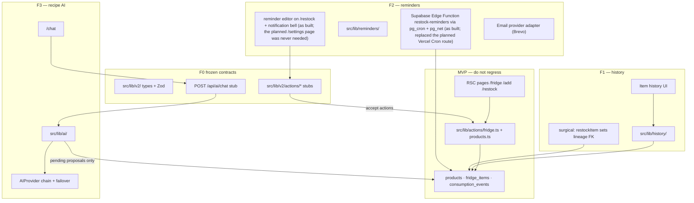

# Fridge Tracker — V2 Foundation Plan

| | |
|---|---|
| **Status** | Historical F0 plan + as-built record. V2 is implemented and hosted-verified; §13 records where the build deliberately diverged from this plan and what F5 verified live. |
| **Date** | 2026-08-18 (plan) · 2026-08-20 (F5 as-built addendum) |
| **Authoring agent** | F0 — V2 Foundation Architect |
| **Companion documents** | `docs/PRODUCT_SPEC.md`, `docs/ARCHITECTURE.md`, `docs/TECHNICAL_DESIGN.md`, `docs/SECURITY.md`, `docs/TEST_SPEC.md`, `docs/IMPLEMENTATION_PLAN.md` |
| **Code contracts** | `src/lib/v2/` (new, frozen) — do **not** edit `src/lib/types.ts` or `src/lib/schemas.ts` for V2 |

This document is the handoff for agents **F1** (item history), **F2** (restock reminders), and **F3** (recipe AI chat). It records architecture, ownership, API shapes, security rules, and the migration plan. Feature UI, schedulers, email, and AI providers are **out of F0 scope** and must be implemented only in the owning agent's directories.

The English/Hebrew assignment briefs are referenced by the existing design docs but are not present in this checkout. Assignment constraints used here are those already extracted in `docs/IMPLEMENTATION_PLAN.md` §2 (mandated stack, single public app, RLS, no unjustified extra infrastructure).

---

## 1. Non-negotiable constraints

1. **The MVP must not regress.** No rewrites of historical migrations. No drive-by edits to frozen Wave 1 contracts (`src/lib/types.ts`, `src/lib/schemas.ts`, existing action signatures).
2. **V2 types live in `src/lib/v2/`.** Existing layers keep importing from `@/lib/types` and `@/lib/schemas`.
3. **Authorization stays in Postgres RLS.** Every new table has RLS enabled. Runtime access still uses the anon key + caller JWT, except for one documented F2 exception (§8.2).
4. **No fridge mutation from AI without an explicit accept action.** Chat may *propose*; only `acceptAIAddProposal` / `acceptAIConsumptionProposal` write fridge rows, and only after the user confirms.
5. **Do not duplicate derivable columns.** `added_at`, `finished_at`, and last-consumption time are not copied onto `fridge_items`. History is assembled from existing columns + `consumption_events` + the new lineage FK.
6. **Directory ownership is disjoint** except for the surgical exceptions in §5. Parallel worktrees must not edit the same modules.

---

## 2. V2 features (what later agents build)

### F1 — Fridge item history / details

A restocked physical unit must know which finished unit it came from (`fridge_items.restocked_from_item_id`). The history view for a unit is **derived**:

| Fact | Source | Stored? |
|---|---|---|
| When added | `fridge_items.added_at` | already stored |
| Last consumption | latest `consumption_events.created_at` for that item with `delta_percent > 0` | derived |
| Consumption timeline | that item's `consumption_events`, ordered by `created_at`, `id` | derived |
| Finished time | `fridge_items.finished_at` | already stored |
| When a finished item was restocked | `added_at` of the child row whose `restocked_from_item_id` points here | derived |
| Restocked-from | `fridge_items.restocked_from_item_id` | **new nullable FK** |

Existing restocks (rows created before this migration) have `restocked_from_item_id = NULL` and remain valid. F1's UI must treat missing lineage as "unknown source", not as an error.

### F2 — Configurable restock reminders

A user may have **multiple** reminder schedules. Each schedule has enable/disable, one or more weekdays (0–6, JS `Date.getDay()`: Sunday = 0), a local time, an IANA timezone, and independent email / in-app channels. Due reminders write an in-app `notifications` row and/or send email. Ordinary clients must not insert notifications.

F0 does **not** implement the scheduler, email provider, or settings UI.

### F3 — Recipe AI chat

The chat uses the current user's fridge as context, recommends recipes, identifies missing ingredients, asks whether a "missing" ingredient is actually present, and then:

- if the user says it **is** present → propose `add_item` (still requires accept);
- otherwise → suggest purchase or substitution (text only, no mutation);
- after a recipe → propose `consume_recipe` fridge updates (still requires accept).

Chat history is **provider-neutral JSON** persisted in `ai_messages.parts`. The model/provider is behind `AIProvider` and must fail over transparently. F0 does **not** add an SDK, generate recipes, or build chat UI.

---

## 3. Architecture



**Layering (same as MVP):**

- Domain modules (`src/lib/history/`, `src/lib/reminders/`, `src/lib/ai/`) are plain TypeScript.
- Server actions own mutations (`src/lib/v2/actions/…`, replacing F0 stubs).
- The AI chat turn is a route handler so F3 can later stream without changing the persisted message contract.
- Pages remain RSC. New client islands stay inside each agent's component folder.

**What F0 deliberately does not add:** queues, Redis, extra UI chrome, provider SDKs, cron implementation, Resend/SMTP, service-role usage under `src/` (F2 introduces that in its own cron route only — §8.2).

---

## 4. Data model and migration

Applied as a **new** file, never a rewrite:

`supabase/migrations/20260818000000_v2_foundation.sql`

### 4.1 Lineage on `fridge_items`

```text
fridge_items.restocked_from_item_id uuid NULL
  → fridge_items(id) ON DELETE SET NULL
  CHECK (restocked_from_item_id IS NULL OR restocked_from_item_id <> id)
  partial index WHERE restocked_from_item_id IS NOT NULL
```

The index is justified: F1's "when was this finished unit restocked?" query is `WHERE restocked_from_item_id = $1`. Most rows are not restocks, so the index is partial.

INSERT/UPDATE RLS is tightened so the referenced source row must belong to `auth.uid()` (same class of bug as the Wave 5 `consumption_events` FK oracle — FKs run as table owner and bypass RLS).

### 4.2 `restock_reminders`

| Column | Type | Notes |
|---|---|---|
| `id` | uuid PK | `gen_random_uuid()` |
| `user_id` | uuid FK `auth.users` ON DELETE CASCADE | owner |
| `days_of_week` | smallint[] | 1–7 unique values, each 0–6 |
| `local_time` | time | naive local clock (`08:30:00`) |
| `timezone` | text | IANA string, 1–64 chars (e.g. `Asia/Jerusalem`) |
| `enabled` | boolean | default true |
| `email_enabled` | boolean | |
| `in_app_enabled` | boolean | |
| `last_sent_key` | text NULL | scheduler idempotency key; **never client-writable** |
| `created_at` / `updated_at` | timestamptz | |

CHECK: if `enabled`, at least one of `email_enabled` / `in_app_enabled` is true. Multiple rows per user are allowed (no unique-on-user constraint).

Suggested `last_sent_key` format (F2 owns the writer): `{yyyy-mm-dd}T{HH:MM}` in the reminder's local zone, e.g. `2026-08-18T09:00`. The cron can skip when the computed key equals `last_sent_key`.

### 4.3 `notifications`

| Column | Type | Notes |
|---|---|---|
| `id` | uuid PK | |
| `user_id` | uuid FK ON DELETE CASCADE | |
| `type` | text | closed set: `restock_reminder` \| `ai_proposal` |
| `title` | text | 1–120 |
| `body` | text | 1–2000 |
| `metadata` | jsonb | default `{}` |
| `read_at` | timestamptz NULL | the only client-updatable column |
| `created_at` | timestamptz | |

Authenticated clients: `SELECT` own rows; `UPDATE (read_at)` only. **No INSERT/DELETE** for `authenticated`. Inserts are `service_role` only (F2 cron).

### 4.4 AI persistence

`ai_conversations` — `id`, `user_id`, `title`, `created_at`, `updated_at`.

`ai_messages` — `id`, `conversation_id` (CASCADE), `role` (`user`\|`assistant`\|`system`), `parts` jsonb (provider-neutral message parts), `seq` int ≥ 0, `created_at`. Unique `(conversation_id, seq)`. Append-only (no UPDATE/DELETE policies).

`ai_action_proposals` — `id`, `conversation_id` (CASCADE), `user_id` (denormalized for RLS), `kind` (`add_item`\|`consume_recipe`), `payload` jsonb, `status` (`pending`\|`accepted`\|`rejected`\|`expired`), `created_at`, `updated_at`.

INSERT of proposals requires `status = 'pending'` and conversation ownership. Authenticated `UPDATE` is granted only on `(status, updated_at)` so a client cannot rewrite `payload` then accept it.

### 4.5 Existing rows / backfill

No backfill. All new columns/tables are additive. `restocked_from_item_id` is NULL for every current row. Reminder/notification/AI tables start empty.

### 4.6 Apply order

Same as today: `supabase db push` (or SQL editor, filename order). This file runs after `20260816000100_data_api_grants.sql`. Hosted production must apply it before F1–F3 features are deployed, or those features' queries will 500.

---

## 5. Directory ownership (parallel-safe)

### 5.1 Frozen after this F0 commit — **no F1/F2/F3 edits**

| Path | Why |
|---|---|
| `supabase/migrations/**` | Schema changes are coordinated, never parallel |
| `src/lib/v2/types.ts` | Frozen V2 domain + API shapes |
| `src/lib/v2/schemas.ts` | Frozen Zod boundaries |
| `src/lib/v2/routes.ts` | Frozen V2 path constants |
| `src/lib/v2/index.ts` | Re-exports |
| `src/lib/v2/not-implemented.ts` | Shared stub helper; delete usages as you implement, do not change the helper |
| `src/lib/types.ts`, `src/lib/schemas.ts` | Wave 1 frozen contracts |
| `src/lib/routes.ts` | F0 already merges V2 protected paths; leave it |
| `package.json` / lockfile | New dependencies require a coordinated commit (F2 email SDK, F3 AI SDK) |

### 5.2 F1 — Item history

**Owns (create/edit freely):**

- `src/lib/history/` — derive `ItemHistory` from items + events + lineage
- `src/lib/v2/actions/history.ts` — replace the stub body of `getItemHistory`
- `src/components/fridge/history/` — details sheet/panel
- Tests colocated under those folders

**Surgical exception (this file only, one behavior):**

- `src/lib/actions/fridge.ts` — inside `restockItem`, set `restocked_from_item_id: data.itemId` on the inserted row. Update `src/lib/actions/fridge.test.ts` accordingly. Do not change `addToFridge` / `setRemaining` / `deleteItem` signatures.

**May read, must not rewrite:** `src/lib/fridge/queries.ts`, `src/lib/fridge/derive.ts`. If the fridge list needs the lineage column, add an optional field in `src/lib/fridge/mappers.ts` `FridgeItemRow` (`restocked_from_item_id?: string | null`) — do not change the frozen `FridgeItem` type; use `FridgeItemWithLineage` from `@/lib/v2`.

**Does not own:** settings, notifications, AI, `/chat`, cron, email.

**Suggested UI mount:** extend the existing consume sheet (F1 may add a "History" block inside `src/components/fridge/ConsumeSheet.tsx` **or** open a sibling sheet from `UnitChip` without replacing consume behavior). Prefer a sibling under `components/fridge/history/` imported by `ConsumeSheet.tsx` so the consume flow stays intact. `ConsumeSheet.tsx` is the only shared UI file F1 should touch.

### 5.3 F2 — Restock reminders + in-app notifications

**Owns:**

- `src/lib/reminders/` — schedule matching, `last_sent_key`, email adapter **interface**
- `src/lib/v2/actions/reminders.ts` — replace CRUD stubs
- `src/lib/v2/actions/notifications.ts` — replace `markNotificationRead` / `listNotifications`
- `src/app/(app)/settings/` — reminder configuration page *(as built: lives on `/restock` instead; no settings page ships and F5 removed the unused route constant)*
- `src/app/api/cron/restock-reminders/route.ts` — create this; F0 did not *(as built: a Supabase Edge Function replaced this route entirely)*
- `src/components/settings/` *(as built: `src/components/reminders/`)*
- `src/components/notifications/`
- `src/components/app-shell/TopBar.tsx` — add settings icon + notification bell only (do not add a Chat tab here)

**Does not own:** `BottomNav.tsx`, AI modules, item history, `fridge.ts`.

**New env vars (document in `.env.example` when implementing, do not set dummy secrets):** `CRON_SECRET`, `SUPABASE_SERVICE_ROLE_KEY` (Vercel, **cron route only**), email provider key (e.g. `RESEND_API_KEY`). Adding a provider package is an F2 coordinated dependency change.

### 5.4 F3 — Recipe AI chat

**Owns:**

- `src/lib/ai/` — orchestration, fridge-context builder, `AIProvider` implementations, failover chain
- `src/lib/v2/actions/ai.ts` — replace accept/reject / conversation-read stubs
- `src/app/api/ai/chat/route.ts` — replace the 501 stub; keep auth + `aiChatRequestSchema`
- `src/app/(app)/chat/`
- `src/components/chat/`
- `src/components/app-shell/BottomNav.tsx` — add the Chat destination only (keep Fridge / Add / Restock)

**Must call existing mutations** from `src/lib/actions/fridge.ts` / `products.ts` inside accept handlers (`addToFridge` / `createManualProduct` / `setRemaining`). Do not duplicate fridge writes.

**Does not own:** `TopBar.tsx`, settings, reminders, cron, `fridge.ts` restock lineage.

### 5.5 Shared files that must not be edited in parallel

| File | Who |
|---|---|
| `src/lib/actions/fridge.ts` | **F1 only** (lineage on restock) |
| `src/components/fridge/ConsumeSheet.tsx` | **F1 only** (history entry point) |
| `src/components/app-shell/TopBar.tsx` | **F2 only** |
| `src/components/app-shell/BottomNav.tsx` | **F3 only** |
| `src/app/(app)/layout.tsx` | Nobody unless a coordinator commit is needed (nav already renders TopBar/BottomNav) |

If F2 and F3 both need a layout slot, F2 puts the bell in `TopBar`; F3 puts Chat in `BottomNav` + `TopBar`'s existing `NAV_LINKS` is **not** F3's file — F3 should add Chat to `BottomNav` and, for desktop, add a Chat link by editing `TopBar.tsx` **only if F2 has not started**. Safer desktop plan: F3 adds Chat to `BottomNav` (mobile) and also to `TopBar.tsx` `NAV_LINKS` **in a follow-up if F2's TopBar work is not yet merged**; coordinator merges TopBar last. Preferred: F3 exports a `CHAT_NAV_LINK` constant from `src/lib/v2/routes.ts` (already frozen as `V2_ROUTES.chat`) and F2, while editing TopBar, includes Chat in `NAV_LINKS` as a one-liner. **F2 must add `{ href: V2_ROUTES.chat, label: "Chat" }` to TopBar `NAV_LINKS` while adding the bell** so F3 does not need TopBar. This is the parallel-safe split.

---

## 6. Frozen API contracts

All TypeScript/Zod live in `src/lib/v2/`. Stubs return `{ ok: false, error: { code: "not_implemented" } }` (V2-only code; MVP `ActionErrorCode` is unchanged).

### 6.1 F1

| Contract | Input | Output |
|---|---|---|
| `getItemHistory` | `{ itemId: uuid }` | `ItemHistory` |

`ItemHistory` includes `addedAt`, `lastConsumedAt`, `finishedAt`, `restockedFromItemId`, `restockedByItemId`, `restockedAt`, `timeline`.

### 6.2 F2

| Contract | Input | Output |
|---|---|---|
| `listRestockReminders` | none | `RestockReminder[]` |
| `createRestockReminder` | days, time, tz, flags | `RestockReminder` |
| `updateRestockReminder` | `id` + patch | `RestockReminder` |
| `deleteRestockReminder` | `{ id }` | `{ id }` |
| `listNotifications` | optional `unreadOnly` | `Notification[]` |
| `markNotificationRead` | `{ id }` | `{ id, readAt }` |

`lastSentKey` is never accepted from the client (omitted from create/update Zod schemas).

### 6.3 F3

| Contract | Input | Output |
|---|---|---|
| `POST /api/ai/chat` | `{ conversationId?, message }` | `AIChatResponse` (200) or API error |
| `listAIConversations` | none | `AIConversationSummary[]` |
| `getAIConversation` | `{ conversationId }` | `AIConversationDetail` |
| `acceptAIAddProposal` | `{ proposalId }` | `{ proposalId, itemIds }` |
| `acceptAIConsumptionProposal` | `{ proposalId }` | `{ proposalId, itemIds }` |
| `rejectAIProposal` | `{ proposalId }` | `{ proposalId, status: "rejected" }` |

HTTP for the stub chat route: `401` unauthenticated, `400` invalid body, `501` not implemented. F3 replaces `501` with `200` + `AIChatResponse`. Provider outages become `{ status: "failed", error: { code: "provider_unavailable" } }` after the failover chain is exhausted — never a raw 5xx caused by a single vendor.

`AIProvider` (in `src/lib/v2/types.ts`) is the replaceable interface. F3 implements adapters in `src/lib/ai/providers/` and a chain that tries the next provider on timeout/5xx/parse failure.

### 6.4 Recipe shapes (shared F3 types, frozen)

- `Recipe` / `RecipeIngredient` (`availability: have | missing | unconfirmed`)
- `ConsumptionProposal` (absolute `fromPercent` → `toPercent` on a specific `itemId`)
- Proposal payloads: `AddItemProposalPayload`, `ConsumeRecipeProposalPayload`

---

## 7. Security rules (V2)

| Table | SELECT | INSERT | UPDATE | DELETE |
|---|---|---|---|---|
| `fridge_items` | own rows (unchanged) | own + lineage source owned | own + lineage source owned | own (unchanged) |
| `restock_reminders` | own | own (`user_id = auth.uid()`) | own | own |
| `notifications` | own | **none** for `authenticated` | `read_at` only (column grant) | **none** for `authenticated` |
| `ai_conversations` | own | own | own (title / `updated_at`) | own (cascades messages + proposals) |
| `ai_messages` | via owned conversation | via owned conversation | **none** (append-only) | cascade only |
| `ai_action_proposals` | own | own, `status = 'pending'`, conversation owned | `status` + `updated_at` only | cascade only |

Additional rules:

- Server actions never take `user_id` from the client; they use `getUser().id`.
- Accept handlers re-read `payload` from the database (column grants already prevent payload edits) and then call existing fridge actions under the same JWT.
- Cross-user reads return empty / `not_found`, same as MVP.
- `last_sent_key` updates happen only on the F2 cron path (service role), not from the browser.
- New tables receive explicit Data API grants (authenticated + service_role), matching `20260816000100_data_api_grants.sql`. `anon` still has no grants.

---

## 8. Runtime exceptions F2/F3 must document when they implement

### 8.1 No new MVP infrastructure required for F1

History is a read over existing rows plus one FK. No jobs.

### 8.2 F2 scheduler + email (accepted V2 exception)

> **As built (F2, verified by F5):** F2 implemented this as a **Supabase Edge
> Function** (`supabase/functions/restock-reminders/`) invoked by
> **pg_cron → pg_net every 5 minutes**, gated by `RESTOCK_CRON_SECRET`
> (stored in Vault, never in committed SQL). The service-role key therefore
> never reaches Vercel at all — it stays inside the Supabase runtime. The
> constraints below record the original plan.

MVP architecture rejected cron/email. V2 reminders require them. Constraints:

- One Vercel Cron route, Hobby-compatible schedule (at least hourly; F2 chooses).
- Gate with `CRON_SECRET` (Bearer). Reject other callers.
- Use `SUPABASE_SERVICE_ROLE_KEY` **only inside that cron route** to insert `notifications` and update `last_sent_key`. Do not create a service-role client anywhere else under `src/`.
- Email adapter behind an interface (`sendRestockReminderEmail`) so the vendor is replaceable. Failures are logged; they must not roll back an in-app notification that already succeeded (or vice versa — F2 records both outcomes in `metadata` / logs).
- Update `docs/SECURITY.md` when the cron route lands (secrets inventory).

### 8.3 F3 provider keys

API keys for AI vendors live in server env only (`AI_PROVIDER_*`). Never `NEXT_PUBLIC_`. Failover order is config, not hardcoded to one vendor in the chat route.

---

## 9. Test expectations

F0 ships Vitest contract tests for V2 Zod schemas, type alignment, stub `not_implemented` results, protected V2 paths, and a SQL-file contract check (table/policy names present in the new migration).

F1/F2/F3 add tests **in their own directories**:

| Agent | Must cover |
|---|---|
| F1 | History derivation (last consumption, restocked-at, null lineage); `restockItem` writes the FK; foreign item → `not_found` |
| F2 | Weekday/time/tz validation; multiple schedules; `last_sent_key` idempotency; notification INSERT denied for authenticated (document + extend `e2e/permissions.spec.ts` when a migrated project is available) |
| F3 | Provider failover; no fridge write on chat turn; accept applies payload; reject leaves fridge unchanged; conversation isolation |

Do not extend Playwright MVP journeys until each feature is implemented. Credentialed RLS tests for new tables are F2/F3 follow-ups on a migrated project.

---

## 10. Documentation updates (this wave)

| Doc | Change |
|---|---|
| `README.md` | Fourth migration; link this plan |
| `docs/TECHNICAL_DESIGN.md` | Pointer to V2 contracts (MVP §3/§6 remain the MVP source of truth) |
| `docs/SECURITY.md` | V2 tables + notification insert exception |
| `docs/ARCHITECTURE.md` | Short V2 pointer (cron/email are V2-only) |
| `docs/TEST_SPEC.md` | V2 foundation tests; feature tests still out of MVP scope |
| This file | Source of truth for V2 |

`docs/PRODUCT_SPEC.md` and `docs/UI_DESIGN.md` stay MVP-accurate. F2/F3 own UI copy when they ship screens.

---

## 11. Suggested later commit messages (not F0)

- F1: `Record fridge restock lineage and derive per-unit history.`
- F2: `Add configurable restock reminder schedules and in-app notification read state.`
- F3: `Add provider-neutral recipe AI chat with explicit fridge-action confirmation.`

---

## 12. Unresolved issues (F0)

> **F5 status:** every item below is resolved. (1) All V2 migrations are
> applied to the hosted project and verified. (3) is moot — the scheduler is
> a Supabase Edge Function, so no service-role key exists on Vercel. (4) F3
> chose Google Gemini (`gemini-2.5-flash`) → Groq (`openai/gpt-oss-120b`)
> with env names `GOOGLE_GENERATIVE_AI_API_KEY` / `GROQ_API_KEY`. (5) F2
> chose Brevo. (6) remains a pre-existing MVP item.

1. **Hosted migration not applied by F0.** Agents F1–F3 will 500 against production until `supabase db push` includes `20260818000000_v2_foundation.sql`.
2. **Assignment markdown files** (`English-Assignment.md`, `Hebrew-Assignment.md`) are not in this repository; requirements were taken from the existing design docs.
3. **F2 service-role on Vercel** is a deliberate break from "no runtime service-role key". It must stay confined to the cron route.
4. **AI provider choice** is not frozen beyond the `AIProvider` interface — F3 picks vendors and env names.
5. **Email vendor** is not frozen — F2 picks one and wraps it.
6. **Physical-phone camera QA** remains pending from MVP (`docs/TEST_SPEC.md` §9) and is unrelated to V2.

---

## 13. F5 as-built verification record (2026-08-20)

What F5 changed and empirically verified against the real hosted
infrastructure (hosted Supabase Frankfurt + Vercel Preview deployments).
Full evidence lives in `docs/SECURITY.md` §24 and `docs/TEST_SPEC.md` §17;
reminder deployment detail in `docs/RESTOCK_REMINDERS.md` §11.

**Deliberate divergences from this plan (all documented in place above):**

- Reminder scheduler: Supabase Edge Function + pg_cron/pg_net (5-minute
  tick), not a Vercel Cron route; `RESTOCK_CRON_SECRET` lives in Supabase
  secrets + Vault; **no service-role key on Vercel, ever**.
- Reminder UI: lives on `/restock`; the reserved `/settings` route constant
  had no consumer and was removed (`src/lib/v2/routes.ts` + contract tests).
- Email vendor: Brevo (`BREVO_API_KEY`, `RESTOCK_EMAIL_FROM`).
- AI vendors: Gemini `gemini-2.5-flash` primary → Groq `openai/gpt-oss-120b`
  fallback (the originally configured `llama-3.3-70b-versatile` was
  decommissioned by Groq and 404s; F5 made the minimal default change).

**Integration defects found on real infrastructure and fixed additively:**

1. `20260818000000` originally used a subquery inside a CHECK constraint —
   Postgres rejects that; rewritten in place (never previously applied) via
   an IMMUTABLE helper function.
2. Hosted project carried legacy default ACLs granting broad table
   privileges — corrected by migration `20260819000100_data_api_privilege_alignment.sql`.
3. The lineage RLS subquery bound `restocked_from_item_id` to the inner
   table, blocking every legitimate restock — corrected by migration
   `20260819000200_fix_lineage_policy_scope.sql`.
4. Tool schemas capped ingredient `quantity` at 40 chars; live models write
   longer strings and Groq enforces the schema server-side (HTTP 400
   `tool_use_failed`) — cap raised to 100, and that vendor error is now
   classified as transient unusable output so the chain fails over instead
   of dying.
5. `NotificationBell` could resurrect a just-read row from an in-flight
   list response (visible under real Preview latency) — refresh now merges
   instead of replacing.
