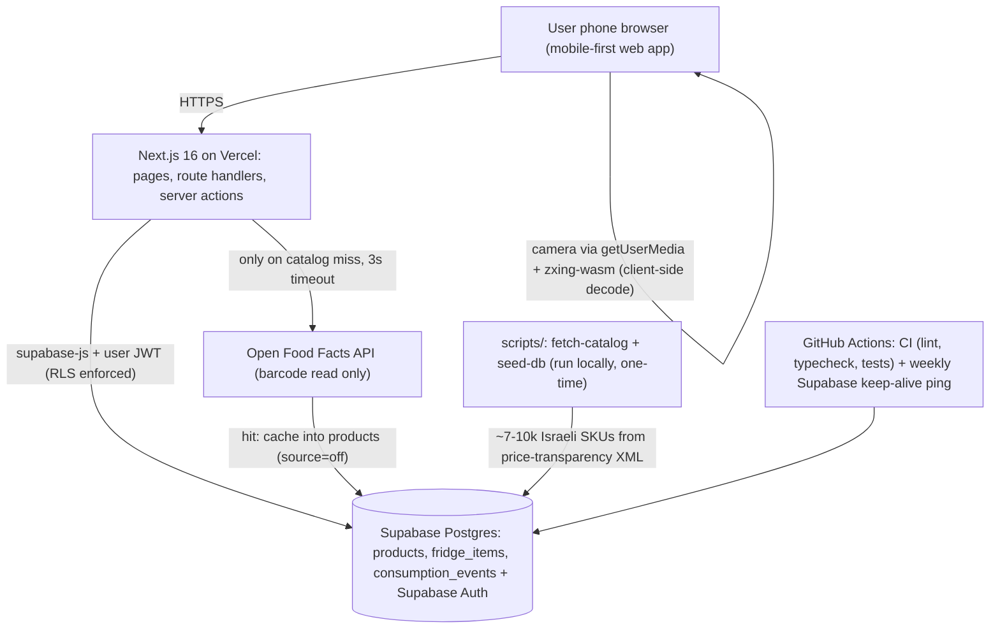
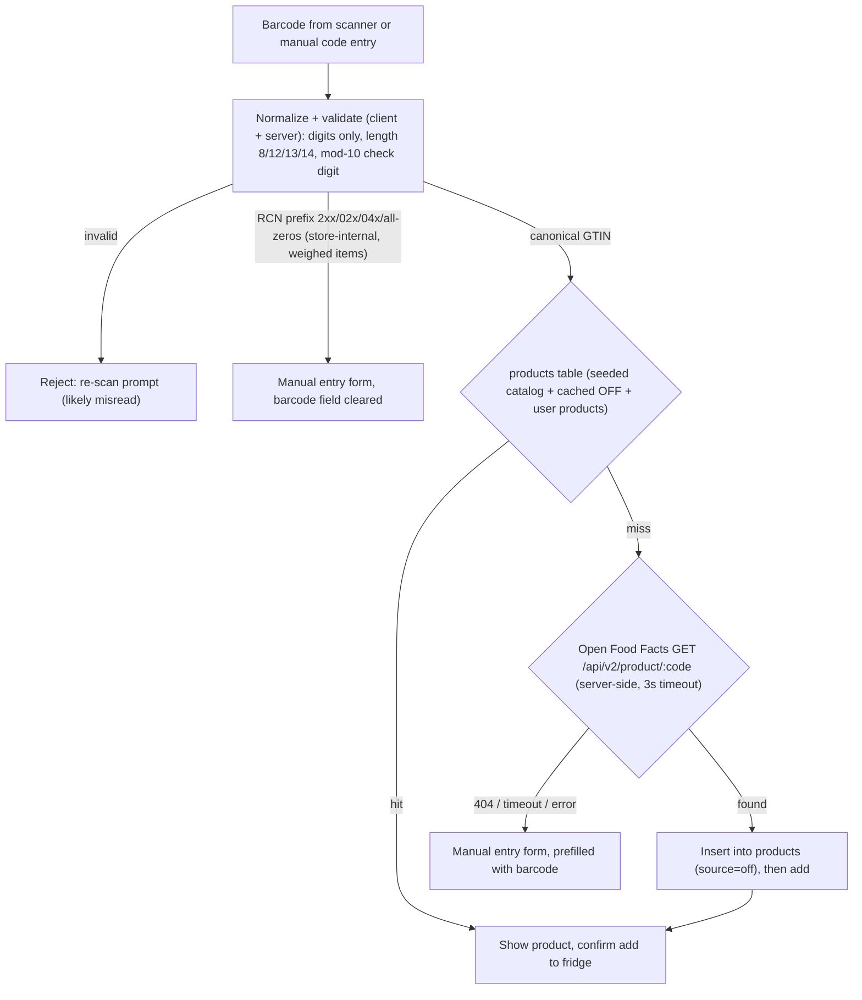
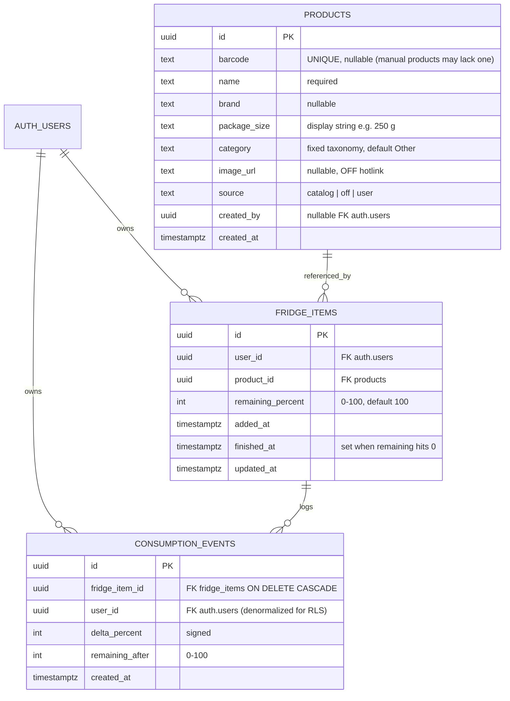
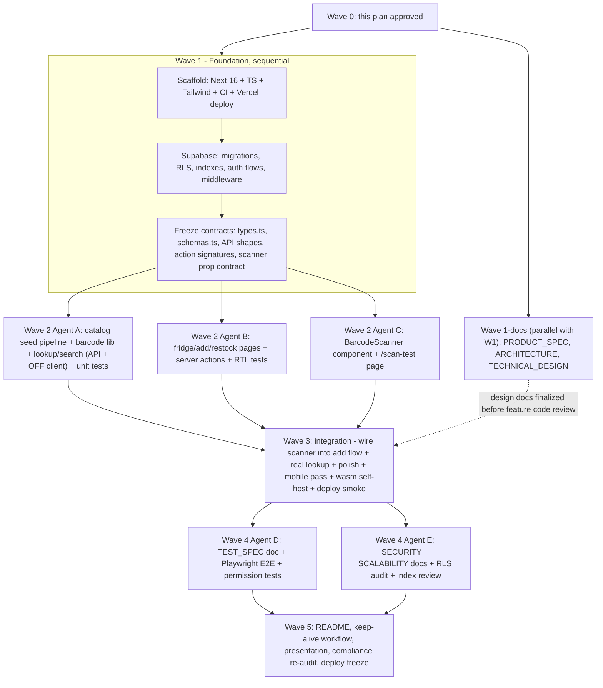

# Fridge Tracker — Final Implementation Plan

| | |
|---|---|
| **Status** | Approved architecture synthesis — the primary technical reference for all implementation agents |
| **Date** | 2026-08-14 |
| **Deadline** | Final submission **September 6, 2026** (~3 weeks) |
| **Inputs synthesized** | `English-Assignment.md`, `Hebrew-Assignment.md` (RUNI CS 2026 final), `.cursor/plans/fridge_tracker_project_plan_228d563a.plan.md` (initial plan), `docs/research/ISRAELI_RETAIL_DATA.md`, `docs/research/BARCODE_APIS.md` |
| **Authority order** | 1. Assignment files → 2. Verified primary-source research → 3. Repository constraints → 4. Engineering judgment → 5. Initial plan |

This document is self-contained. An implementation agent with no access to prior conversations must be able to build the project from this document plus the two research reports in `docs/research/`.

---

## 1. Executive Summary

**Fridge Tracker** is a mobile-first web application for managing the contents of a household fridge, aimed at Israeli households. A user scans a grocery barcode with their phone (or searches/enters manually), the product is identified against a locally seeded Israeli product catalog with an Open Food Facts fallback, and the item is tracked in the user's fridge with a fractional consumption model (Full → ¾ → ½ → ¼ → Finished). A restock view shows what is running low or recently finished so the user knows what to buy again.

**Stack (mandated by the assignment):** Next.js 16 (App Router) + TypeScript, Supabase (Postgres + Auth, RLS), Vercel deployment.

**The load-bearing architectural decisions, in one paragraph:** There is no separate backend service — Next.js route handlers and server actions on Vercel are the backend. Product identification is a three-step chain: (1) our own `products` table in Supabase, seeded offline from Israel's statutory price-transparency data (~7–10k GTIN-keyed Shufersal SKUs, legally free for any use under §30(e) of the Israeli Food Law); (2) Open Food Facts barcode lookup as an at-runtime fallback, with hits cached into our table; (3) manual entry. Barcode scanning runs in the browser via `@yudiel/react-qr-scanner` (WASM ZXing under the hood — works on iOS Safari, where the native BarcodeDetector API is confirmed unavailable). No email, no cron jobs, no queues, no OpenIsraeliSupermarkets dependency. Restocking is an in-app view derived from fridge state.

Three findings from the critical review of prior work (details in §25):

1. The initial plan's scanner choice (`html5-qrcode`) is **rejected** — the library is officially unmaintained; replaced with the actively maintained `@yudiel/react-qr-scanner` → `barcode-detector` → `zxing-wasm` stack (verified 2026-08-14).
2. The contradiction between the two research reports about Open Food Facts' Israeli coverage (8,092 vs ~3,554 products) was **independently resolved** on 2026-08-14: both numbers are real outputs of different OFF backends; the search index is ~2 years stale, the live v2 count is 8,092. Architecturally irrelevant either way — OFF stays a fallback.
3. OpenIsraeliSupermarkets is **dropped entirely** (initial plan already leaned this way): non-commercial license, hosted API observed down, single maintainer — and our own ~100-line fetcher against Shufersal's portal was already prototyped successfully during research.

---

## 2. Assignment Requirements Summary

Extracted from `English-Assignment.md` / `Hebrew-Assignment.md` (identical in substance). These are non-negotiable.

**Mandated technology:**

- Next.js, TypeScript, Supabase (database, optionally auth), Vercel (deployment).
- The product must be reachable at a public URL.

**Mandated deliverables (10 submission items):**

1. Link to the deployed app on Vercel
2. Link to the GitHub repository
3. Product specification document (business + product view)
4. Technical design document (folders, components, DB, CRUD, API, business logic, state management, error handling, validation, UX)
5. Test specification document
6. Test code (Vitest / Jest / RTL / Playwright / documented manual tests where appropriate)
7. Basic scalability document
8. Basic security document
9. Local setup and run instructions + explanation of required environment variables
10. 10–15 minute product presentation

**Mandated process:** product selection → product spec → architecture design → detailed technical design → implementation → test spec → test implementation → scalability doc → security doc → deployment. Documents are written **before** code (stages 2–4 precede stage 5).

**Explicit grading emphasis:** "It is better to build a small, clear, useful, secure, and well-built product than a large, disorganized, and unstable one." Product thinking, clean code, proper DB use, meaningful tests, basic security/scalability understanding, and the ability to explain **every** technical decision (agents are encouraged, but the student must understand the system "inside and out").

**Not required by the assignment (despite appearing in early ideas):** email/notifications infrastructure, background jobs, multiple user roles, native mobile app, price data.

---

## 3. Final Product Scope

**Problem:** households forget what is in the fridge, let food run out (or spoil), and rebuild the shopping list from memory. In Israel there is no mainstream tool that maps a scanned local barcode to a product and tracks home inventory.

**Users:** members of a household doing regular grocery shopping (in Israel). **Customer:** the household itself (B2C). **Business value:** less food waste, fewer "we're out of milk" moments, faster shopping-list creation. (The product spec document expands this.)

**Core user flow:**

```text
Buy groceries → open web app on phone → scan barcode (or search / manual entry)
→ product identified → added to my fridge → consume over time (Full→¾→½→¼→Finished)
→ restock view shows "running low" + "recently finished" → next shopping trip
```

**One role only:** authenticated user. Each user owns exactly one fridge (their own rows). The product catalog is shared read-only reference data. No sharing, no households, no admin UI in the MVP.

---

## 4. MVP vs Stretch Goals

### 4.1 Mandatory (assignment, regardless of product)

Auth-gated app on the mandated stack, deployed on Vercel + Supabase, with all 8 documents, test code, and presentation (§2).

### 4.2 Core MVP (the demo)

1. Sign up / log in / log out (Supabase Auth, email + password).
2. Add product to fridge via: **(a)** camera barcode scan, **(b)** text search of the catalog, **(c)** manual product creation. Multiple units supported.
3. Product identification chain: our DB → Open Food Facts → manual (§6).
4. Fridge inventory view grouped by category, per-unit remaining level, delete item.
5. Consume action: set remaining level (100/75/50/25/0), finished state at 0.
6. Restock view: "running low" + "finished recently" + recent-activity list; one-tap "restocked" to re-add a finished item.
7. Seeded Israeli catalog (~7–10k products) so search and scanning work without any external service.

### 4.3 Stretch (only after the MVP is stable, tested, and documented)

In priority order — implement top-down only if time remains after Wave 4 (§20):

1. Email restock digest (Vercel Cron — daily schedule is enough on Hobby — + Resend). *Explicitly not in MVP; not required by the assignment.*
2. Second seeded chain (Rami Levy via the Cerberus FTP portal) for broader catalog coverage.
3. Expiry-date field with "expiring soon" in the restock view.
4. PWA manifest (home-screen install).
5. "Photograph missing product" write-back to Open Food Facts.

**Explicitly rejected for this project:** nutrition features, OCR, AI product recognition, price comparison, household sharing, microservices/queues/K8s of any kind, always-fresh mirroring of supermarket data.

---

## 5. Final Architecture

One Next.js repo. Supabase is the only external infrastructure at runtime, Open Food Facts the only external API — called server-side, only on catalog misses.



Layering rules:

- **Pages / server components** fetch data directly via a server-side Supabase client. No client-side data fetching except the scanner's lookup call.
- **Server actions** (`src/lib/actions/`) own all mutations (fridge CRUD, consume, manual product creation).
- **Route handlers** (`src/app/api/`) own the two read APIs used by client components during the add flow: barcode lookup and product search.
- **Domain logic** (`src/lib/barcode/`, `src/lib/products/`, `src/lib/fridge/`) is plain TypeScript, imported by both, unit-testable without mocking Next.js.
- **No service-role key at runtime.** All runtime DB access uses the anon key + user session; RLS is the authorization layer. The service-role key is used only by the local seed script.

---

## 6. Product / Barcode Resolution Architecture

The most-reviewed decision in this synthesis. Final flow:



### 6.1 Decisions and rationale

| Question | Decision | Rationale (evidence) |
|---|---|---|
| Primary product source | **Our own `products` table**, seeded offline from Israel's price-transparency data (Shufersal portal) | Statutorily free for any use incl. commercial (Food Law §30(e), verified in `ISRAELI_RETAIL_DATA.md` §2); one store yields 6.5–7.5k items, ~97% real 13-digit GTINs (observed); a ~30-line fetcher was live-prototyped during research; zero runtime dependency, perfect demo reliability |
| Which chains to seed | **Shufersal only** for MVP (2–3 large stores across sub-chains, union ≈ 7–10k SKUs) | One portal engine ≈ minimal code; largest chain ≈ best coverage per effort; adding Rami Levy is stretch #2 |
| OpenIsraeliSupermarkets | **Not used** — not at runtime, not as a library, not the Kaggle dump | Non-commercial custom license (conflicts with the assignment's "real business value" framing), hosted API observed down and self-described "small unstable instance", bus factor 1; our own fetcher is trivially sufficient (all verified in `ISRAELI_RETAIL_DATA.md` §4) |
| Open Food Facts role | **Runtime fallback for identity + enrichment** (name, brand, quantity, image URL), never search | 9/10 iconic Israeli staples resolved with Hebrew names + photos; product-read endpoint reliable (median 304 ms) while search/facets returned 503 for a full test window (`BARCODE_APIS.md` §4); free, no key, ODbL |
| Commercial barcode APIs | **Rejected** | Measured 4/10 and 0/15 hit rates on Israeli products at $39–$949/month, marketplace-junk quality, one wrong-product hit (`BARCODE_APIS.md` §5) |
| Cache OFF results? | **Yes — permanently, into `products` with `source='off'`** | Turns every first scan into shared catalog data; second scan of the same product never leaves our DB; ODbL obligations are attribution + share-alike on the cached rows (light for a student project; attribution rendered in footer + README, see §17) |
| Negative caching of misses | **No** | Misses are rare and cheap; complexity not justified |
| Unknown barcode | Manual-entry form **prefilled with the normalized barcode**; saved as `source='user'` product visible to all users | Keeps flow unblocked; grows the catalog |
| Weighed-goods / store-internal codes (RCN — the full GS1 restricted set on the canonical 13-digit form: `200–299`, `020–029`, plus the company-internal `040–049` and all-zeros-prefix ranges; `2xx`/`02x` is the common Israeli weighed-goods case) | Detected **before** any lookup → routed straight to manual entry | By GS1 standard these can never resolve in any global DB (`BARCODE_APIS.md` §3.4 verifies all four ranges; TECHNICAL_DESIGN §4.4 specifies them) |
| EAN/UPC/GTIN storage | **TEXT column**, canonical OFF-style form: strip to digits → validate check digit → EAN-8 stays 8 digits; 9–12 digits zero-pad to 13; 13 stays; 14 with leading 0 strips to 13 | Preserves leading zeros (a BIGINT would corrupt UPC-A codes); cache keys identical to OFF `code` values; both tested APIs accept this form (`BARCODE_APIS.md` §3.6) |
| What we copy locally | barcode, name, brand/manufacturer, package size, category (ours), image URL (OFF hotlink) | Minimum needed for the product experience |
| What we do NOT copy | Prices, promotions, store lists, nutrition | Not needed for fridge tracking; prices imply a freshness promise we can't keep; keeps DB small and the story clean |

### 6.2 Seed pipeline (one-time, local)

1. `scripts/fetch-catalog.ts` — downloads 2–3 `PriceFull*.gz` files from `https://prices.shufersal.co.il` (portal structure and file format documented with observed examples in `ISRAELI_RETAIL_DATA.md` §3.2–3.3), parses XML, filters out `bIsWeighted=1` rows and codes failing GTIN validation, dedupes by barcode, applies keyword→category mapping, writes **`data/catalog-seed.csv`** (committed to the repo, ~1–2 MB — legal per §30(e), makes seeding reproducible for graders without network access to Israeli portals).
2. `scripts/seed-db.ts` — loads the CSV into `products` via the service-role key (`.env.local` only). Idempotent (upsert on barcode).
3. Run from an Israeli network (some chain portals reportedly geo-block; the student is in Israel — non-issue). **Never fetch chain portals at request time from Vercel.**

---

## 7. Database Model

Supabase Postgres. Three application tables + Supabase-managed `auth.users`. Every application table has RLS enabled. Entities deliberately rejected: `ProductSource` (a column suffices), `Notification`/`ShoppingState` (derived at read time), `profiles` (no profile data needed).



**Per-entity notes:**

- **`products`** — shared catalog. One row per GTIN (or per manual product). Ownership: rows with `source='catalog'` belong to the system (seeded); `'off'` rows are cached lookups (created_by = the user whose scan triggered the cache); `'user'` rows are manual creations. In MVP for all users to read — the same Tnuva Cottage row serves every user without duplication. **MVP: yes.**
- **`fridge_items`** — one row per **physical unit** ("2 milk cartons, one half-finished" = 2 rows, 100 and 50). Simpler consume math than quantity+fraction encoding; matches the product idea directly. Adding N units inserts N rows. **MVP: yes.**
- **`consumption_events`** — append-only log written in the same server action as each consume; powers the recent-activity list on the restock page and gives the DB story a 1:N event table. Deliberately minimal. **MVP: yes** (it is load-bearing for a visible feature; if timeline pressure demands cuts, this is the first cut — the restock view itself only needs `fridge_items`).
- **Category taxonomy (fixed, ours):** Dairy, Meat & Fish, Vegetables, Fruit, Drinks, Sauces & Spreads, Snacks, Prepared, Frozen, Other. The transparency schema has **no category field** (verified — regulation forbids extra fields), so seed-time keyword mapping + user choice is the only option.

**Indexes:** `products(barcode)` unique partial (`WHERE barcode IS NOT NULL`); `products` GIN `gin_trgm_ops` on `name` (Hebrew-compatible ILIKE/similarity search); `fridge_items(user_id, finished_at)`; `fridge_items(product_id)`; `consumption_events(user_id, created_at DESC)`.

**RLS policies (the authorization layer):**

| Table | SELECT | INSERT | UPDATE | DELETE |
|---|---|---|---|---|
| products | any authenticated | authenticated, `created_by = auth.uid()` AND `source IN ('user','off')` | own rows with `source='user'` only | none |
| fridge_items | `user_id = auth.uid()` | `user_id = auth.uid()` | `user_id = auth.uid()` | `user_id = auth.uid()` |
| consumption_events | `user_id = auth.uid()` | `user_id = auth.uid()` | none | none |

Seed rows (`source='catalog'`, `created_by NULL`) are inserted by the local script with the service-role key, which bypasses RLS by design. Concurrent OFF-cache inserts of the same barcode: `ON CONFLICT (barcode) DO NOTHING` + re-select.

---

## 8. Backend Architecture

The backend is the Next.js server runtime on Vercel. No extra layers: no repositories-over-repositories, no DI containers, no separate API service.

**Modules:**

| Module | Path | Responsibility |
|---|---|---|
| Barcode domain | `src/lib/barcode/` | `normalizeBarcode()` (digits → canonical form), `isValidGtin()` (mod-10 check), `classify()` (`gtin` / `rcn` / `invalid`). Pure functions, table-driven tests |
| Product lookup | `src/lib/products/` | `lookupByBarcode()` (DB → OFF → not_found), `searchProducts()` (trigram ILIKE + pagination), `offClient.ts` (fetch wrapper: field selection, custom User-Agent, 3s `AbortController` timeout, maps OFF response → our `Product` shape) |
| Fridge domain | `src/lib/fridge/` | Derivations: `isLow()` (remaining ≤ 25 and not finished), grouping, restock summary query |
| Server actions | `src/lib/actions/fridge.ts`, `src/lib/actions/products.ts` | `addToFridge`, `setRemaining` (writes event + `finished_at`), `deleteItem`, `restockItem`, `createManualProduct`. Each: auth check → Zod parse → DB write → `revalidatePath` |
| Route handlers | `src/app/api/products/lookup/route.ts`, `src/app/api/products/search/route.ts` | Thin HTTP wrappers over `src/lib/products/` |
| Supabase clients | `src/lib/supabase/` | `server.ts` (cookie-bound, for RSC/actions/handlers via `@supabase/ssr`), `client.ts` (browser), `middleware.ts` (session refresh) |
| Validation | `src/lib/schemas.ts` | All Zod schemas, shared by actions, handlers, and tests |

**Error handling policy:** route handlers return `{ error: { code, message } }` with correct HTTP status (400 invalid barcode, 401 unauthenticated, 502 upstream); server actions return discriminated unions `{ ok: true, data } | { ok: false, error }` — never throw across the client boundary; OFF failures are **degraded, not fatal** (treated as not-found with a `fallbackUsed` flag); global `error.tsx` + `not-found.tsx`.

**Caching behavior:** the products table is the permanent lookup cache (§6). Route handlers are dynamic (auth-bound); no HTTP-level caching in MVP.

---

## 9. Frontend Architecture

- **Framework:** Next.js 16 App Router (current stable 16.3.x, verified 2026-08-14), React server components by default, TypeScript strict.
- **Styling:** Tailwind CSS + a small set of shadcn/ui primitives (vendored into the repo — ideal for the assignment's "explain every component" requirement) + `sonner` for toasts. Mobile-first: the primary device is a phone. *As built (Wave 2/3): the primitives are hand-written shadcn-style equivalents in `src/components/ui/` and toasts are a small custom `Toaster` component rather than the sonner package — package files were frozen during parallel Wave 2 work, and the owned code is easier to explain; see UI_DESIGN §14.1.*
- **State management:** server-centric. Server components fetch; after mutations, server actions `revalidatePath` and the UI re-renders. Client state is local `useState` only in: scanner, add-flow tabs, consume control (with `useOptimistic` for instant feedback). **No Redux/Zustand/React Query** — nothing in this app justifies them; this is the documented state-management answer for the technical design doc.
- **Language/RTL:** English UI; product names are Hebrew and rendered with `dir="auto"` on name elements. (Flippable decision — see §24.)

**Pages (5 routes):**

| Route | Purpose |
|---|---|
| `/login`, `/signup` | Auth forms (Supabase email+password). Unauthenticated users are redirected here by middleware |
| `/fridge` | Home. Inventory grouped by category; unit chips with remaining level; consume control (tap unit → pick new level: Full/¾/½/¼/Finished); delete; filter tabs All / Low / Finished |
| `/add` | Three tabs: **Scan** (camera), **Search** (debounced catalog search, paginated), **Manual** (name required; barcode/brand/size/category optional). Units stepper (default 1) → confirm |
| `/restock` | Running-low list + finished-recently list (last 14 days) + recent-activity feed (from consumption_events) + "restocked" button re-adding a fresh unit |

**Barcode scanning UX:** `<BarcodeScanner onDetected={(code) => ...} />` isolated client component wrapping `@yudiel/react-qr-scanner` with `formats={['ean_13','ean_8','upc_a','upc_e']}`, rear camera constraint, torch toggle where supported. States: requesting-permission → scanning → detected (haptic/beep + pause). Permission denied / no camera → inline manual code entry field (always rendered below the viewport as well). After detection: normalize client-side (instant misread rejection) → call lookup API → product-confirm sheet or manual-form redirect per §6 flow.

**Why this scanner library (supersedes the initial plan):** the native BarcodeDetector API is unavailable on iOS Safari (disabled by default through Safari 26.x per caniuse, and broken under the flag since iOS 18 per Apple dev forums; verified 2026-08-14). `html5-qrcode` from the initial plan is officially unmaintained. `@yudiel/react-qr-scanner` v2.6 (MIT, ~250k weekly downloads, active 2026 releases) wraps the maintained `barcode-detector` ponyfill (v3.2.1, July 2026) over `zxing-wasm` — WASM decoding works on every modern mobile browser. Note: the ZXing `.wasm` binary loads from jsDelivr CDN by default; hardening task in Wave 3 self-hosts it via `prepareZXingModule` for demo independence. *Done in Wave 3: `scripts/sync-zxing-wasm.mjs` copies the installed binary to `public/wasm/` before every dev/test/build run, and the scanner registers a `locateFile` override (`src/components/scanner/zxing-config.ts`) so the decoder loads from our origin.*

---

## 10. API Contract

Auth for all endpoints/actions: valid Supabase session (cookie). Unauthenticated → 401 (handlers) / redirect (pages).

**Route handlers (reads used by client components):**

| Endpoint | Purpose | Input | Output | Failures |
|---|---|---|---|---|
| `GET /api/products/lookup?barcode=` | Resolve a scanned/typed code via the §6 chain | raw barcode string | `{ status: 'found', product, source: 'db'\|'off' }` \| `{ status: 'not_found', barcode }` \| `{ status: 'invalid'\|'rcn', reason }` | 400 malformed param; 401; OFF timeout → `not_found` + `fallbackUsed: true` (never 5xx to the client for OFF failures) |
| `GET /api/products/search?q=&page=` | Catalog text search for the Add flow | `q` (1–60 chars), `page` ≥ 1 | `{ items: Product[], page, hasMore }` (page size 20) | 400 bad params; 401 |

**Server actions (mutations):**

| Action | Input (Zod-validated) | Behavior | Failures |
|---|---|---|---|
| `addToFridge` | `productId: uuid, units: int 1–20` | Inserts N `fridge_items` rows at 100% | 401; unknown product; RLS violation |
| `setRemaining` | `itemId: uuid, remainingPercent: 0\|25\|50\|75\|100` | Updates item; writes `consumption_events` row (signed delta); sets/clears `finished_at` at 0/regain | 401; not owner (RLS); no-op if unchanged |
| `deleteItem` | `itemId: uuid` | Hard-deletes item (events cascade) | 401; not owner |
| `restockItem` | `itemId: uuid` | Inserts a fresh 100% item for the same product | 401; not owner |
| `createManualProduct` | `{ name 1–80, barcode?, brand?, packageSize?, category }` | Normalizes/validates barcode if present; inserts `source='user'`; on barcode conflict returns the existing product; optional `addUnits` to also add to fridge | 401; invalid barcode; duplicate → returns existing (not an error) |

**Auth endpoints:** none custom — Supabase SDK (`signUp`, `signInWithPassword`, `signOut`) handles the auth API; middleware refreshes sessions.

The TypeScript types + Zod schemas for everything above are frozen at the end of Wave 1 (`src/lib/types.ts`, `src/lib/schemas.ts`) and are the contract parallel agents build against.

---

## 11. Authentication

- **Supabase Auth, email + password** (assignment explicitly permits Supabase auth; it's the minimal-code, maximal-explainability option — passwords hashed by GoTrue with bcrypt, session as JWT in httpOnly cookies via `@supabase/ssr`).
- Middleware (`src/middleware.ts`) refreshes the session and gates `/fridge`, `/add`, `/restock`, `/api/*`; `/login`, `/signup` are public.
- **Email confirmation: disabled** in Supabase settings — deliberate demo-reliability decision (free-tier confirmation emails are rate-limited and slow; a live signup during the presentation must not depend on email delivery). Documented in the security doc as a known tradeoff with the production fix (enable confirmation + custom SMTP).
- No OAuth, no magic links, no roles/permissions beyond "authenticated user" — single-role model documented in the architecture doc (an assignment question).

---

## 12. Consumption Model

**Model:** per-unit integer `remaining_percent` constrained to steps {100, 75, 50, 25, 0}, mutated by **setting the new absolute level** (tap ¾/½/¼/Finished), not by entering deltas.

Why this model: trivial to implement (one int column + check constraint), one-tap mobile UX, idempotent (re-tapping ½ is a no-op — safe against double-taps), works for any product type (a "quarter left" of milk, hummus, or eggs is equally meaningful as an approximation), directly matches the project idea (100 → consume 25 → 75), and mistakes are correctable (setting a higher value is allowed and logged as a negative-delta event).

**At zero:** `finished_at` is stamped; the unit leaves the main fridge list into the Finished section; it appears in the restock view's "finished recently" for 14 days; "Restocked" creates a fresh 100% unit and keeps the finished row as history. Finished rows are retained (they power restock and history), deletable by the user.

**Multiple units:** each is its own row; the fridge UI groups rows by product and shows per-unit chips (e.g., Milk ×2: [100%] [50%]). Consuming targets a specific unit.

---

## 13. Restocking / Notifications

**Decision: in-app only for MVP. No email, no cron, no background jobs.** The assignment does not require notifications; the product goal ("know what to buy again") is fully served by a view computed at read time:

- **Running low:** live units with `remaining_percent <= 25` and `finished_at IS NULL`.
- **Finished recently:** `finished_at` within the last 14 days, excluding products the user already restocked since.
- **Recent activity:** last ~10 `consumption_events`, humanized.

Low-stock state is **derived, not stored** — no flags to keep consistent, nothing to schedule, always correct. User-triggered (opening `/restock`), not automatic.

**Stretch (documented, not built):** daily email digest via Vercel Cron (Hobby tier allows daily cron — sufficient) + Resend free tier, reusing the exact restock query. This is the honest scalability-doc answer to "what would you add with more time," not an MVP feature. Avoids: schedulers, queues, delivery monitoring, unsubscribe handling.

---

## 14. Deployment

Mandated: **Vercel** (app) + **Supabase** (database). No conflict with any decision above — verified.

| Concern | Decision |
|---|---|
| Frontend + backend | Single Next.js project on Vercel (Hobby tier), production branch = `main`, preview deployments per PR |
| Database + auth | One Supabase project, **EU (Frankfurt)** region (closest to Israeli users) |
| Migrations | SQL files in `supabase/migrations/`, applied via Supabase CLI locally (`supabase db push`); schema is reviewable in-repo |
| Env vars (Vercel) | `NEXT_PUBLIC_SUPABASE_URL`, `NEXT_PUBLIC_SUPABASE_ANON_KEY` — both client-safe by design (RLS is the security boundary) |
| Env vars (local only, never on Vercel) | `SUPABASE_SERVICE_ROLE_KEY` (seed script only), documented in `.env.example` + README |
| External API keys | **None** (OFF requires only a User-Agent string — a constant, not a secret) |
| CORS | None needed — the browser only calls same-origin `/api/*`; server-to-OFF is not subject to CORS |
| HTTPS / camera | `getUserMedia` requires a secure context — Vercel domains are HTTPS (and `localhost` is exempt for dev) |
| Build | `next build` on Vercel; CI (GitHub Actions) runs lint + typecheck + unit tests on every push; Vercel deploy is independent of CI but the repo rule is: never merge red |
| Free-tier limitation | Supabase Free pauses after ~7 days of low activity (verified against current docs 2026-08-14). Mitigation: **GitHub Actions scheduled workflow** (2×/week `SELECT 1` ping via the REST API) so the app is alive during the post-submission grading window; documented in README |
| Known limits accepted | Supabase Free 500 MB DB (seed ≈ 5–10 MB — fine); Vercel Hobby function limits (lookup is one fetch — fine) |

---

## 15. Testing Strategy

Matches the assignment's list (Vitest, RTL, Playwright, documented manual tests) without inventing extra stack. Test spec document (`docs/TEST_SPEC.md`) enumerates all of this before implementation.

| Layer | Tool | What (the meaningful cases) |
|---|---|---|
| Unit — barcode | Vitest | Table-driven: normalization (9–12→13 pad, 14→13 strip, EAN-8 stays 8), check-digit accept/reject, RCN classification (all four GS1 ranges: `2xx`/`02x`/`04x`/all-zeros), garbage input |
| Unit — consumption | Vitest | setRemaining transitions incl. `finished_at` set/clear, event delta signs, idempotent re-set, low/finished derivation boundaries (25 vs 26) |
| Unit — lookup chain | Vitest (mocked fetch + mocked DB layer) | DB hit short-circuits; OFF hit maps + caches; OFF 404 → not_found; OFF timeout → not_found + `fallbackUsed`; RCN never calls OFF |
| Unit — validation | Vitest | Zod schemas: boundary + malicious inputs (the assignment's "invalid inputs" requirement) |
| Component | React Testing Library | Add-flow manual form validation errors; consume control renders levels and disables current; restock list sections |
| E2E | Playwright (against local dev + seeded test user) | One smoke flow: sign up → log in → search "במבה" → add 2 units → consume one to 50% → finish it → appears in `/restock` → restock it. Auth-redirect check (logged-out `/fridge` → `/login`) |
| Permissions | Vitest integration (two test users against a local Supabase or mocked policies) + documented SQL RLS review | User B cannot read/update user A's fridge_items (the assignment's authorization test requirement) |
| Manual (documented checklist) | — | Camera scanning on a real iPhone (Safari) + Android (Chrome): permission grant, EAN-13 detect, torch, misread rejection, RCN routing; explicitly permitted by the assignment ("documented manual tests where appropriate") — camera hardware is not meaningfully automatable in CI |
| Static | CI | `tsc --noEmit`, ESLint, `next build` |

Deliberately **not** doing: coverage targets, visual regression, load testing, contract-testing frameworks — no assignment requirement and no payoff at this scale.

---

## 16. Demo Reliability Strategy

The demo must not depend on anything outside the deployed app + Supabase.

| Risk | Mitigation |
|---|---|
| Open Food Facts down/slow during demo | Demo products are in the **seeded catalog** — lookups never reach OFF; 3s timeout + manual fallback if one does; rehearse one OFF-path scan in advance and pre-cache it (first scan caches into the DB permanently) |
| Camera permission blocked / scanner fails on stage | Manual barcode entry field always visible; search and manual-add are equal-class flows; permission pre-granted on the demo phone; scan rehearsed on the actual device (iPhone Safari) |
| ZXing wasm CDN (jsDelivr) hiccup | Wave 3 hardening self-hosts `zxing_reader.wasm` from our own origin |
| Supabase Free paused by inactivity | GitHub Actions keep-alive ping 2×/week + manual dashboard check the morning of the demo/grading |
| Stale deployment / last-minute regressions | Deploy freeze 48h before submission; smoke script (login → add → consume → restock) run against production after every deploy |
| Known-good demo barcodes | Rehearsal kit in README: Bamba `7290000066318`, Cottage `7290004127329`, Tnuva milk `7290004131074` (verified present in OFF with Hebrew names + photos, and in the Shufersal seed) + one deliberately-unknown code to demo the manual-entry path |
| Venue network flakiness | App is server-rendered and light; fridge already populated with realistic data beforehand; demo user pre-created (no live signup dependency — though live signup works since email confirmation is off) |
| Hebrew rendering issues | `dir="auto"` on product names, checked in component tests and manual checklist |

---

## 17. Security Considerations

Proportionate to the assignment's "basic security" chapter; each item maps to a section of `docs/SECURITY.md`.

- **Passwords / sessions:** never touch passwords — Supabase GoTrue (bcrypt) handles them; JWT sessions in httpOnly cookies via `@supabase/ssr`; middleware refresh.
- **Authorization:** RLS on every table (§7) is the single enforcement point — even a buggy server action cannot cross user boundaries because queries run with the caller's JWT. Server actions additionally check auth up-front for clean errors.
- **User data isolation:** `user_id = auth.uid()` policies on `fridge_items` / `consumption_events`; verified by permission tests (§15).
- **Input validation:** Zod at every boundary (actions + route handlers); barcode module rejects malformed codes before any DB/external call; supabase-js parameterizes SQL (no string concatenation anywhere).
- **API protection:** all routes auth-gated; mutations via server actions (Next.js enforces same-origin for action POSTs); no state-changing GETs.
- **Secrets:** anon key is public by design (RLS is the boundary — this is the documented Supabase model); service-role key exists only in `.env.local` for seeding, never on Vercel, never in git; `.env.example` documents everything; no other secrets exist (OFF is keyless).
- **XSS:** React escaping; no `dangerouslySetInnerHTML`; OFF-sourced strings rendered as text; image URLs restricted to OFF's image host via `next.config` remote patterns.
- **Residual risks (documented honestly, per the assignment):** no email verification (demo tradeoff, §11); no rate limiting on the lookup endpoint (abuse could burn OFF quota — production fix: per-user token bucket); shared catalog accepts user-created products (a hostile user could add junk products visible to others — acceptable for MVP, fix: per-user visibility or moderation); no CAPTCHA on signup.

---

## 18. Assignment Compliance Matrix

| # | Assignment requirement | Planned implementation | Status |
|---|---|---|---|
| 1 | Web product with real business value | Fridge Tracker: reduces food waste + shopping friction for Israeli households (product spec doc argues this) | Covered |
| 2 | Product specification document | `docs/PRODUCT_SPEC.md` — problem, users, customer, business goals, capabilities, main processes (Wave 1) | Covered |
| 3 | Architecture design: components, DB?, entities, pages, API routes/server actions, data flow, roles/permissions, external libraries + why | `docs/ARCHITECTURE.md` derived from §5–§11 of this plan; single-role model stated explicitly; library justifications from §9/§25 | Covered |
| 4 | Detailed technical design: folders, components, DB structure, CRUD, API, business logic, state, errors, validation, UX | `docs/TECHNICAL_DESIGN.md` derived from §7–§12 (+ folder tree from Wave 1 scaffold) | Covered |
| 5 | Implementation in Next.js + TypeScript | Next.js 16, TS strict | Covered |
| 5 | Supabase for DB (auth optional) | Supabase Postgres + RLS + Supabase Auth | Covered |
| 5 | Vercel deployment, public URL | §14 | Covered |
| 6 | Test spec: features, invalid inputs, business processes, permissions, DB, edge cases, basic UI | `docs/TEST_SPEC.md` per §15 (permissions tests included — single role but per-user isolation is tested) | Covered |
| 7 | Test implementation (Vitest/Jest/RTL/Playwright/manual) | Vitest + RTL + Playwright + documented manual camera checklist (§15) | Covered |
| 8 | Scalability doc: dozens–hundreds of users, expensive queries, indexes, over-fetching, pagination, client/server separation, limits, future | `docs/SCALABILITY.md`: per-user data is small; catalog read-mostly with barcode-unique + trigram indexes; paginated search; RSC minimizes payloads; limits = Supabase Free/single region; future = email digest, second chain, materialized restock view | Covered |
| 9 | Security doc: authn, authz, logged-in-only ops, cross-user protection, validation, API protection, secrets, remaining risks | `docs/SECURITY.md` per §17 | Covered |
| 10 | Submission: app link, repo link, local setup instructions, env-vars explanation | README (Wave 5): setup incl. Supabase CLI + seed script + `.env.example` | Covered |
| 11 | Agent use allowed; student must understand and be able to justify everything | This plan + `TECHNICAL_DESIGN.md` are the assignment-recommended "internal explainer"; every library choice has a recorded rationale (§25); small dependency surface by design | Covered |
| 12 | 10–15 min presentation covering product, problem, users, value, architecture, DB, processes, tests, scalability, security, future work | `docs/presentation/` deck in Wave 5; §16 rehearsal kit | Covered |
| — | "Small, clear, secure, well-built over big and unstable" | The entire §4 scope discipline; stretch list gated on MVP stability | Covered |
| — | Docs written before code (stages 2–4 before 5) | Wave 1 produces the three design docs before/alongside the skeleton, strictly before feature code (Wave 2) | Covered — **keep this ordering during execution** |

No requirement is currently in "Needs attention" state. The matrix must be re-audited in Wave 5 against the actual artifacts.

---

## 19. Implementation Dependency Graph



**Hard dependencies:** nothing in Wave 2 starts before Wave 1's contracts are committed (schema + types + API shapes). Wave 3 requires all three Wave 2 agents merged. Wave 4 requires an integrated app. Stretch items only after Wave 4 is green.

---

## 20. Implementation Waves

Timeline anchors (deadline Sep 6; ~22 days total, ≥2 days buffer).

### Wave 1 — Foundation (days 1–4, single agent) + docs (parallel agent)

- **Goal:** deployed skeleton with auth, full schema, frozen contracts; assignment design docs drafted.
- **Modules:** repo scaffold (`create-next-app`, Tailwind, ESLint, Vitest config, GitHub Actions CI), `supabase/migrations/*` (all three tables + RLS + indexes + pg_trgm), `src/lib/supabase/*`, `src/middleware.ts`, `/login` + `/signup` + protected empty `/fridge`, Vercel project + env vars, `.env.example`, README skeleton, `src/lib/types.ts` + `src/lib/schemas.ts` + stub route handlers/actions returning fixtures.
- **Docs agent (parallel, no file overlap):** `docs/PRODUCT_SPEC.md`, `docs/ARCHITECTURE.md`, `docs/TECHNICAL_DESIGN.md` — content derived from this plan (assignment stages 2–4 satisfied before feature code).
- **Definition of done:** production URL serves login → empty fridge; migrations applied; CI green; contracts committed; docs drafted.
- **Parallel-safe:** the docs agent only. Code foundation is strictly single-agent.

### Wave 2 — Features (days 4–10, three parallel agents in worktrees)

| Agent | Scope | Owns (no other agent touches) | Done when |
|---|---|---|---|
| **A — Catalog & lookup** | `scripts/fetch-catalog.ts` (+ committed `data/catalog-seed.csv`), `scripts/seed-db.ts`, `src/lib/barcode/*`, `src/lib/products/*` (incl. OFF client), real implementations of both route handlers, unit tests | `scripts/`, `data/`, `src/lib/barcode/`, `src/lib/products/`, `src/app/api/` | Seeded prod DB (~7–10k rows); lookup returns Bamba from DB and caches an OFF-only product; tests green |
| **B — Fridge UX** | `/fridge`, `/add` (Search + Manual tabs; Scan tab renders a placeholder slot for C's component), `/restock`, all server actions, RTL tests | `src/app/(app)/`, `src/components/fridge/`, `src/lib/actions/`, `src/lib/fridge/` | Full add→consume→restock loop works via search/manual against stub-then-real lookup |
| **C — Scanner** | `<BarcodeScanner onDetected>` component per §9, permission states, manual-entry fallback, standalone `/scan-test` page; verify on a real iPhone + Android | `src/components/scanner/` | EAN-13 detected on both real phones on the deployed preview |
- **Prerequisites:** Wave 1 contracts. B consumes A's API shape and C's prop contract — both frozen; integration itself is deferred to Wave 3.
- **Safety:** directory ownership is disjoint by construction; shared files (`types.ts`, `schemas.ts`, migrations) are **frozen** — any change requires stopping and doing a coordinated commit on main first.

### Wave 3 — Integration & polish (days 10–14, single agent)

- Wire C's scanner into B's Scan tab through A's lookup; product-confirm sheet; RCN/unknown-barcode routing to prefilled manual form; optimistic consume; empty/loading/error states; mobile styling pass on a real phone; self-host ZXing wasm; deploy + production smoke test.
- **Done when:** the full §3 user flow works end-to-end on a phone against production.

### Wave 4 — Tests & hardening docs (days 14–19, two parallel agents)

- **Agent D:** `docs/TEST_SPEC.md`, Playwright smoke flow, permission tests, manual camera checklist, CI wiring for E2E.
- **Agent E:** `docs/SECURITY.md`, `docs/SCALABILITY.md`, RLS audit (attempt cross-user access with a second test user), index/pagination review (`EXPLAIN` on search + restock queries).
- Disjoint files (D: tests + test doc; E: two docs + SQL review notes) → safe in parallel.

### Wave 5 — Submission (days 19–22, single agent)

- Final README (setup, env vars, seed instructions, demo barcode kit), Supabase keep-alive GitHub Action, presentation deck (10–15 min per assignment §12 list), compliance matrix re-audit against real artifacts, deploy freeze, submission package.
- **Stretch window:** only if Wave 4 finished early — take items from §4.3 top-down.

---

## 21. Parallel-Agent Execution Strategy

- **Wave 1: one agent.** Schema, auth, contracts, and deployment must be one coherent mind; parallelizing foundations is how integration hell starts. (Docs agent runs alongside — markdown only, zero code conflict.)
- **Wave 2: coordinator + three worktree agents.** Each agent gets: this document, its ownership row from §20, and the frozen contract files. Cursor worktrees (or three branches) per agent; the coordinator merges A → C → B (A and C are leaf modules; B touches the app shell most).
- **Wave 3: one agent** (integration is inherently cross-module).
- **Wave 4: two parallel agents** (disjoint deliverables).
- **Wave 5: one agent.**
- **Never parallel:** migrations/schema changes, `types.ts`/`schemas.ts` edits, Supabase config, Vercel config, `package.json` dependency additions (coordinate through the wave coordinator; agents must not independently add dependencies beyond their declared stack).
- **Commits:** one commit per completed task within an agent's scope; wave ends = merge to main + deploy + smoke test = integration checkpoint. CI (lint, typecheck, unit tests) runs on every push; Playwright runs in Wave 4+ and before submission.
- **Fresh agent chats:** new chat per wave, and per agent within Waves 2/4. Every chat starts from this document — it is written to be sufficient without conversation history.
- **Contracts stable before parallel work:** DB schema + RLS, TS types, Zod schemas, the two API response shapes, the five server-action signatures, `BarcodeScanner` props, route map, Tailwind/shadcn base setup.

---

## 22. Risks and Mitigations

| # | Risk | Likelihood / impact | Mitigation |
|---|---|---|---|
| 1 | Shufersal portal unreachable or format-changed at seed time | Low / high | Portal + file format live-verified 2026-08-14 (research §3.3); fetch early (Wave 2, day 1 of Agent A); committed CSV makes it a one-time risk; fallback: OFF-only + manual still demos the full flow |
| 2 | Scanner fails on the student's actual phone | Low / high | Library verified maintained + iOS-capable; `/scan-test` page tested on real devices in Wave 2 (not deferred to integration); manual entry is an equal-class flow |
| 3 | OFF outage or rate-limit during development/demo | Medium / low | Seeded catalog covers the demo; 3s timeout degrades to manual; server-side call volume is tiny (cache-miss only) |
| 4 | Supabase Free paused during grading window | Medium / high | Keep-alive GitHub Action + pre-demo dashboard check (§14) |
| 5 | Wave 2 agents drift from contracts | Medium / medium | Contracts frozen + directory ownership + coordinator merges + CI typecheck catches shape drift |
| 6 | Timeline slip (3 weeks incl. docs + tests) | Medium / high | Docs largely derived from this plan (cheap); stretch list is strictly post-MVP; consumption_events is the designated schema cut if needed (§7) |
| 7 | Hebrew search quality disappoints | Low / medium | pg_trgm handles Hebrew substrings; barcode scan and category browsing are alternate discovery paths |
| 8 | ODbL obligations overlooked | Low / low | Attribution footer + README section + `source='off'` rows identifiable/exportable (§6, §17) |
| 9 | Grader cannot run locally (no Israeli network for seed) | Low / medium | `data/catalog-seed.csv` committed — local setup never touches chain portals |

---

## 23. Final Technical Decisions

```text
Frontend:
Decision: Next.js 16 (App Router) + TypeScript strict + Tailwind CSS + vendored shadcn/ui primitives; server components by default; no global state library.
Why: Next.js/TS mandated; 16.3 is current stable (verified 2026-08-14); vendored UI code satisfies "explain every component"; app state is inherently server state.

Backend:
Decision: Next.js server on Vercel — server actions for mutations, two route handlers for reads; domain logic in plain TS modules. No separate service.
Why: Assignment names "API routes or server actions" as the expected shape; anything more is unjustified operational complexity.

Database:
Decision: Supabase Postgres, three tables (products, fridge_items one-row-per-unit, consumption_events), fixed category taxonomy, RLS on everything, barcode as TEXT with unique partial index, pg_trgm search index.
Why: Mandated platform; minimum schema that cleanly separates shared catalog from per-user state; per-unit rows make fractional consumption trivial.

Authentication:
Decision: Supabase Auth email+password via @supabase/ssr cookies; middleware-gated routes; email confirmation disabled; single role.
Why: Assignment-sanctioned, minimal custom code, RLS integration for free; confirmation-off is a deliberate, documented demo-reliability tradeoff.

Barcode scanning:
Decision: @yudiel/react-qr-scanner (barcode-detector ponyfill + zxing-wasm), formats ean_13/ean_8/upc_a/upc_e, self-hosted wasm, manual code entry always available.
Why: Native BarcodeDetector is confirmed unusable on iOS Safari and html5-qrcode (initial plan) is unmaintained — both verified 2026-08-14; this is the actively maintained cross-browser stack.

Israeli product source:
Decision: Self-written one-time fetch of Shufersal PriceFull XML → committed CSV → seeded products table (~7-10k GTIN-keyed SKUs). No OpenIsraeliSupermarkets anywhere. No prices stored.
Why: Statute §30(e) makes the data free for any use; research live-verified the portal, format, and ~97% GTIN rate; OIS adds a non-commercial license and an unstable dependency for zero MVP benefit.

Open Food Facts:
Decision: Runtime fallback only, server-side barcode reads only (never search/facets), 3s timeout, custom User-Agent, hits cached permanently into products, attribution rendered.
Why: Measured 9/10 on Israeli staples with reliable ~300ms reads, while its search layer 503'd for a full test window; free and keyless; caching makes every product a one-time external hit.

Caching:
Decision: The products table is the only cache (permanent, shared across users). No negative caching, no HTTP caching, no Redis/edge cache.
Why: Read-mostly catalog of ~10k rows in Postgres with proper indexes needs nothing else at this scale.

Notifications:
Decision: In-app restock view (derived at read time: low = remaining ≤ 25%, finished = last 14 days) + recent-activity feed. No email, no cron, no stored notification state in MVP; email digest documented as stretch.
Why: Not an assignment requirement; derived state eliminates a table and a scheduler while fully serving the product goal.

Deployment:
Decision: Vercel (Hobby) + Supabase Free (EU-Frankfurt); migrations via Supabase CLI in-repo; two public env vars on Vercel; service-role key local-only; GitHub Actions CI + 2x/week keep-alive ping.
Why: Platforms mandated; the keep-alive neutralizes the verified 7-day free-tier pause during the grading window; no runtime service-role key materially strengthens the security story.
```

---

## 24. Unresolved Questions

Only two remain; neither blocks implementation start.

1. **UI language: English (current decision) vs full Hebrew UI.**
   - *Unknown:* the student's preference for the presentation audience.
   - *Why it matters:* full Hebrew means RTL layout throughout (~a day of extra layout work), not just product names.
   - *Resolve by:* student decision before Wave 2 Agent B starts. Default stands: English UI, Hebrew product names with `dir="auto"`.
   - *Blocks:* nothing (Wave 1 is language-neutral).

2. **Seed breadth: is one chain's ~7–10k SKU union enough in practice for the student's own real fridge?**
   - *Unknown:* real-world hit rate on the student's actual groceries (research measured stores' assortments, not one household's basket).
   - *Why it matters:* if many personal items miss, stretch #2 (second chain) rises in priority.
   - *Resolve by:* during Wave 2, Agent C's real-phone test scans ~15 items from the student's kitchen through the seeded DB; decide on stretch #2 with data.
   - *Blocks:* nothing (the fallback chain handles misses by design).

---

## 25. Appendix — Critical-Review Log (what changed vs prior documents and why)

Corrections applied to the **initial plan** (`.cursor/plans/fridge_tracker_project_plan_228d563a.plan.md`):

1. **Scanner library replaced.** Initial plan: `html5-qrcode` ("iOS Safari support; native BarcodeDetector is Chromium-only"). Verified 2026-08-14: `html5-qrcode` is in unmaintained "maintenance mode" per its own README; caniuse + Apple dev forums confirm native BarcodeDetector is disabled-by-default on all Safari versions and broken under the flag since iOS 18. Replacement: `@yudiel/react-qr-scanner` v2.6 (MIT, releases through May 2026) → `barcode-detector` v3.2.1 (July 2026) → `zxing-wasm`.
2. **OFF Israeli-coverage figure corrected and contradiction resolved.** Initial plan and `ISRAELI_RETAIL_DATA.md` §5.1 said "~8k IL products"; `BARCODE_APIS.md` §4.3 measured ~3.5k and called 8k stale. Re-probed 2026-08-14: v2 API (live MongoDB) returns **8,092**; Search-a-licious returns **3,554** with `last_indexed_datetime` values from **October 2024** — the search index is stale, the live count is ~8k. Both reports' architectural conclusion (OFF = fallback) is unaffected and adopted. Lesson recorded: never build on OFF's search layer, only on barcode reads — now doubly evidenced (503s + stale index).
3. **OpenIsraeliSupermarkets hardened from "legitimate accelerator" to "not used at all".** The research permitted its use for an academic project; this synthesis rejects even that: the assignment stresses business-value framing (NC license friction) and deep understanding (a vendored 100-line fetcher we fully own beats a third-party scraper), and the research itself observed the hosted API down.
4. **Email digest demoted decisively.** Initial plan listed it as "M8 if time remains"; this plan removes it from all MVP waves and gates it behind a completed Wave 4 (§4.3, §13). The assignment never asks for it.
5. **`consumption_events` given an explicit product justification** (recent-activity feed) plus a designated-cut clause (§7) — the initial plan included it without either.
6. **Supabase pause risk extended to the grading window** with an automated keep-alive (initial plan only said "unpause before grading").
7. **Committed seed CSV added** so graders and agents can set up locally without Israeli-network access to chain portals (initial plan seeded from live fetch only).

Research claims spot-verified this session (2026-08-14): OFF v2 count endpoint (8,092 — reproduced), Search-a-licious count (3,554 — reproduced, stale index identified), BarcodeDetector Safari status (caniuse + Apple forums), scanner-library maintenance (GitHub/npm), Next.js stable = 16.3.1, Supabase free-tier 7-day pause policy (current official docs). Claims accepted on the research reports' primary-source evidence without re-verification: Israeli Food Law §30(e) reuse clause, transparency-file format/field schedules, Shufersal portal probes, OFF staple hit rates, commercial-API hit rates, GS1/RCN semantics, OFF rate limits and licensing.
