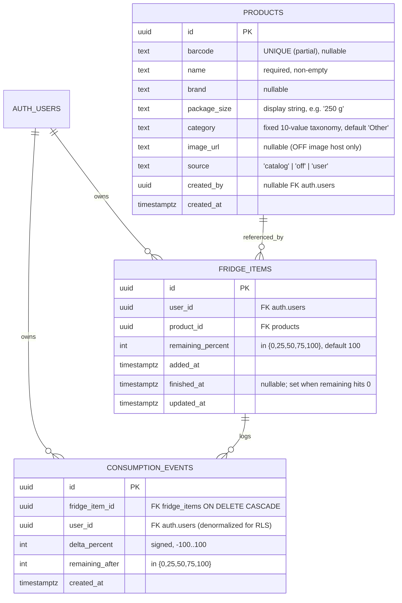
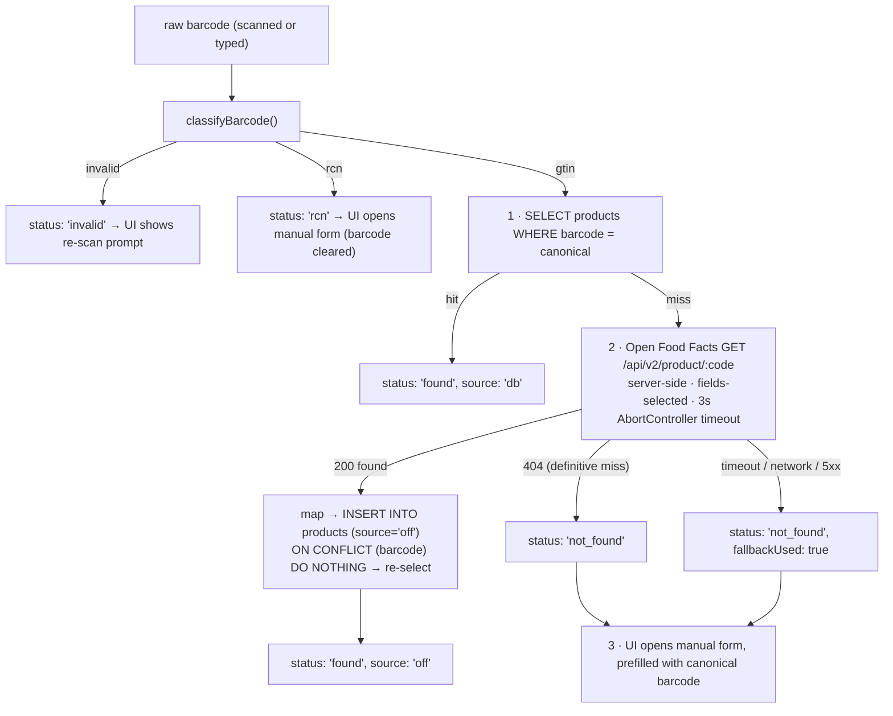
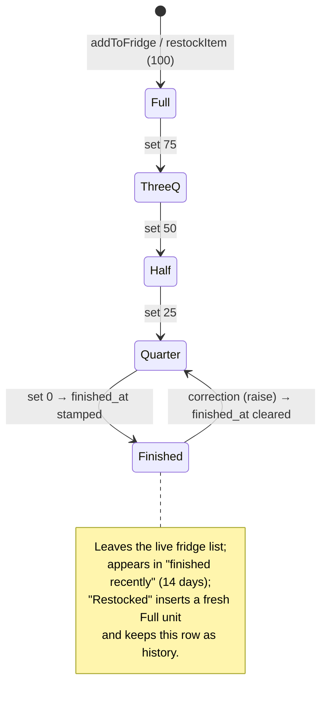

# Fridge Tracker — Detailed Technical Design

| | |
|---|---|
| **Course** | Internet Technologies — Become a Full-Stack Engineer (RUNI CS 2026, final assignment) |
| **Document role** | Assignment stage 4 — detailed technical design, written **before implementation** |
| **Status** | Historical MVP design (written when the repository contained documentation only). The MVP and V2 are now fully implemented; where reality diverged, later documents win: `docs/FEATURES_V2_PLAN.md` (V2 architecture + §13 as-built record), `docs/RESTOCK_REMINDERS.md` (reminder worker), `docs/SECURITY.md` (final RLS/privilege posture incl. §24 hosted verification), `docs/TEST_SPEC.md` §17 (final test evidence). |
| **Date** | 2026-08-15 |
| **Companion documents** | `docs/PRODUCT_SPEC.md` (what and why), `docs/ARCHITECTURE.md` (system structure), `docs/IMPLEMENTATION_PLAN.md` (decision log and build order) |

---

## 1. Purpose and Reading Guide

This document is the blueprint the implementation is built against: repository layout, database schema with constraints and RLS policies, the barcode domain, the product-resolution flow, the full API contract (route handlers and server actions), frontend structure and UX states, authentication, error handling, validation, and state management. Where a choice needed a tie-break, the rationale is recorded inline so every decision can be explained at presentation time.

## 2. Planned Repository Structure

Legend: items marked *(exists)* are in the repository today; everything else is planned.

```text
.
├── English-Assignment.md / Hebrew-Assignment.md   # assignment briefs (exist)
├── docs/                                          # (exists)
│   ├── IMPLEMENTATION_PLAN.md                     # approved implementation plan (exists)
│   ├── PRODUCT_SPEC.md                            # stage 2 document (exists)
│   ├── ARCHITECTURE.md                            # stage 3 document (exists)
│   ├── TECHNICAL_DESIGN.md                        # stage 4 — this document (exists)
│   ├── research/                                  # verified research reports (exist)
│   ├── TEST_SPEC.md                               # stage 6 (planned, before test implementation)
│   ├── SCALABILITY.md                             # stage 8 (planned)
│   ├── SECURITY.md                                # stage 9 (planned)
│   └── presentation/                              # 10–15 min deck (planned)
│
├── src/                                           # (planned)
│   ├── app/
│   │   ├── (auth)/
│   │   │   ├── login/page.tsx                     # public: sign-in form
│   │   │   └── signup/page.tsx                    # public: registration form
│   │   ├── (app)/                                 # authenticated app shell (layout + bottom nav)
│   │   │   ├── fridge/page.tsx                    # home: inventory view
│   │   │   ├── add/page.tsx                       # scan / search / manual tabs
│   │   │   └── restock/page.tsx                   # restock summary
│   │   ├── api/
│   │   │   └── products/
│   │   │       ├── lookup/route.ts                # GET barcode resolution
│   │   │       └── search/route.ts                # GET catalog text search
│   │   ├── layout.tsx · globals.css
│   │   └── error.tsx · not-found.tsx              # global error boundaries
│   ├── components/
│   │   ├── ui/                                    # hand-vendored shadcn-style primitives (button, input, badge, modal, skeleton)
│   │   ├── fridge/                                # feature components (inventory, add flow, restock — see §9.2)
│   │   └── scanner/                               # BarcodeScanner client island + typed-code fallback
│   ├── lib/
│   │   ├── actions/
│   │   │   ├── fridge.ts                          # addToFridge · setRemaining · deleteItem · restockItem
│   │   │   └── products.ts                        # createManualProduct
│   │   ├── barcode/                               # pure domain: normalize · validate · classify (§4)
│   │   ├── products/                              # lookup chain · search query · Open Food Facts client (§5)
│   │   ├── fridge/                                # derivations: low/finished · grouping · restock summary (§8)
│   │   ├── supabase/
│   │   │   ├── server.ts                          # cookie-bound server client (RSC / actions / handlers)
│   │   │   ├── client.ts                          # browser client (auth forms)
│   │   │   └── middleware.ts                      # session-refresh helper used by src/middleware.ts
│   │   ├── types.ts                               # shared domain types — frozen contract (§6.1)
│   │   └── schemas.ts                             # all Zod schemas — frozen contract (§12)
│   └── middleware.ts                              # session refresh + route gating (§10)
│
├── scripts/                                       # (planned; run locally only, never deployed)
│   ├── fetch-catalog.ts                           # price-transparency XML → data/catalog-seed.csv
│   └── seed-db.ts                                 # CSV → products table (service-role key, .env.local only)
├── data/
│   └── catalog-seed.csv                           # committed seed (~1–2 MB) — reproducible setup for graders
├── supabase/
│   └── migrations/                                # SQL migrations (tables, constraints, indexes, RLS) via Supabase CLI
├── tests/                                         # (planned)
│   ├── e2e/                                       # Playwright smoke flow
│   └── permissions/                               # cross-user RLS isolation tests
│   # unit tests are colocated with their modules: src/**/*.test.ts
├── .github/workflows/                             # ci.yml (lint · tsc · unit tests) + keep-alive.yml (scheduled DB ping)
├── .env.example                                   # documents every environment variable
└── README.md                                      # setup, env vars, seed instructions, demo barcode kit
```

Layering rules the structure encodes:

- `src/lib/barcode|products|fridge` are **plain TypeScript** — no Next.js imports — so business logic is unit-testable in isolation.
- Server actions own **all mutations**; route handlers own the **two client-initiated reads**; pages (server components) own page reads. No other data paths exist.
- `types.ts` and `schemas.ts` are frozen contracts: every layer (actions, handlers, components, tests) imports the same definitions.

## 3. Database Design

Supabase Postgres. Three application tables plus Supabase-managed `auth.users`. Extensions: `pg_trgm` (trigram name search); UUIDs via `gen_random_uuid()`.

### 3.1 Tables



**`products` — shared catalog.** One row per GTIN (or per barcode-less manual product). `barcode` is nullable because manual products may not have one. `category` comes from the fixed taxonomy: `Dairy, Meat & Fish, Vegetables, Fruit, Drinks, Sauces & Spreads, Snacks, Prepared, Frozen, Other` (the seed source's statutory schema contains no category field — verified in research — so categories are assigned by a keyword→category mapper at seed time, by the same mapper for cached OFF rows, and by user choice for manual products; unmatched defaults to `Other`).

**`fridge_items` — one row per physical unit.** Two milk cartons are two rows. This makes fractional consumption a single-column update, keeps "which carton did I open?" unambiguous in the UI, and avoids quantity+fraction encoding arithmetic. `updated_at` is set by the mutating server action.

**`consumption_events` — append-only log.** Written in the same server action as each consume; powers the restock page's recent-activity feed. `user_id` is denormalized (also derivable via the item) so RLS on this table is a direct column comparison.

### 3.2 Relationships and referential actions

| Relationship | FK | On delete |
|---|---|---|
| fridge_items → auth.users | `user_id` | `CASCADE` (deleting an account removes its fridge) |
| fridge_items → products | `product_id` | `NO ACTION` — products are never deleted (no DELETE policy exists), so this cannot fire |
| consumption_events → fridge_items | `fridge_item_id` | `CASCADE` (deleting an item removes its history) |
| consumption_events → auth.users | `user_id` | `CASCADE` |
| products → auth.users | `created_by` | `SET NULL` (catalog rows outlive their creators) |

### 3.3 Check constraints and uniqueness

| Table | Constraint | Purpose |
|---|---|---|
| products | `UNIQUE INDEX ON products(barcode) WHERE barcode IS NOT NULL` | **Barcode uniqueness** — one catalog row per GTIN. A *partial* unique index, because many manual products legitimately have `barcode = NULL` and Postgres unique indexes would otherwise still allow that but the partial form documents intent and keeps the index small. |
| products | `CHECK (source IN ('catalog','off','user'))` | Provenance is a closed set. |
| products | `CHECK (char_length(name) > 0)` | No empty names at the storage layer (length ceilings are enforced at the validation boundary, §12). |
| products | `CHECK (category IN (…the 10 taxonomy values…))` | The taxonomy is closed; invalid categories cannot enter storage. |
| fridge_items | `CHECK (remaining_percent IN (0,25,50,75,100))` | The five-level consumption model is enforced by the database, not just the UI. |
| consumption_events | `CHECK (remaining_after IN (0,25,50,75,100))` | Same invariant on the log. |
| consumption_events | `CHECK (delta_percent BETWEEN -100 AND 100)` | Sanity bound on deltas (sign encodes direction, delta = old − new per plan §12: positive = consumed, negative = correction upward). |

### 3.4 RLS policies (the authorization layer)

RLS is **enabled on all three tables**. All runtime access uses the anon key + the caller's JWT; `auth.uid()` is the authenticated user's id. The seed script inserts `source='catalog'` rows with the service-role key, which bypasses RLS by design and exists only locally.

| Table | SELECT | INSERT | UPDATE | DELETE |
|---|---|---|---|---|
| `products` | any authenticated user (shared catalog) | authenticated, with `created_by = auth.uid()` **and** `source IN ('user','off')` | own rows (`created_by = auth.uid()`) with `source = 'user'` only | **none** (catalog rows are never deleted) |
| `fridge_items` | `user_id = auth.uid()` | `user_id = auth.uid()` | `user_id = auth.uid()` | `user_id = auth.uid()` |
| `consumption_events` | `user_id = auth.uid()` | `user_id = auth.uid()` | **none** (append-only) | **none** (removed only via item cascade) |

Notes:

- The products INSERT policy is what lets the **server-side OFF cache write** run under the *user's* JWT (the scanning user becomes `created_by`, `source='off'`) — no privileged key needed at runtime.
- The products UPDATE policy permits self-correction of one's own manual products; the MVP ships **no product-edit UI**, so the policy is dormant but principled.
- Ownership model in one sentence: **catalog rows belong to everyone (read) and to their creator (limited write); fridge and history rows belong exclusively to one user.**

### 3.5 Indexes

| Index | Serves |
|---|---|
| `products(barcode)` unique partial (above) | The lookup chain's primary query — exact barcode match |
| `GIN (name gin_trgm_ops)` on `products` | Substring/similarity name search that works for Hebrew text (`ILIKE '%…%'` with trigram acceleration) |
| `fridge_items(user_id, finished_at)` | The fridge view (live items per user) and restock derivations (finished items per user, recent-first) |
| `fridge_items(product_id)` | Join back to catalog; "does the user hold a live unit of this product" checks |
| `consumption_events(user_id, created_at DESC)` | Recent-activity feed (last ~10 events per user) |

### 3.6 Migrations

Schema changes ship as SQL files in `supabase/migrations/`, applied with the Supabase CLI (`supabase db push`). The full schema — tables, constraints, indexes, extensions, RLS policies — is therefore reviewable in the repository and reproducible on a fresh project.

## 4. Barcode Domain (`src/lib/barcode/`)

Pure functions, no I/O, table-driven tests. This module runs **twice** per scan — in the browser (instant misread rejection before any network call) and on the server (the trust boundary).

### 4.1 Accepted input forms

- Scanner detections in formats `ean_13`, `ean_8`, `upc_a`, `upc_e` (the scanner component's configured format list). UPC-E detections are expanded to their UPC-A (GTIN-12) form at the scanner layer — the standard GS1 expansion — before entering this module.
- Typed codes from the manual-entry field: free text, possibly containing spaces or hyphens.

### 4.2 Normalization and validation pipeline

```text
raw string
  → strip whitespace and hyphens
  → must be digits only            (else: invalid — "not a barcode")
  → length must be 8–14            (else: invalid — unsupported length;
                                    9–11 digits are accepted as GTIN-12/13
                                    forms that lost leading zeros and are
                                    restored by canonicalization, matching
                                    the OFF convention — research §3.6)
  → mod-10 check digit must verify (else: invalid — "likely misread, re-scan";
                                    the check digit is right-anchored, so it
                                    is invariant under left zero-padding)
  → canonicalize (§4.3)
  → classify: RCN store-internal vs GTIN (§4.4)
```

The **GTIN check digit** is the GS1 mod-10 algorithm: weight digits alternately 3 and 1 from the right (rightmost body digit gets weight 3), sum, round up to the next multiple of 10; the difference is the check digit. Validating it locally catches camera misreads cheaply — important because Open Food Facts does not validate check digits and would report a corrupted code as a plausible-looking "unknown product," sending the user into a pointless manual-entry flow (behavior confirmed in research).

### 4.3 Canonical form (per length)

| Input | Handling | Rationale |
|---|---|---|
| **EAN-8** (8 digits) | Stays 8 digits | GTIN-8 is a separately allocated short number, *not* a truncated GTIN-13; padding it would fabricate a different code. |
| **UPC-A** (12 digits) | **Zero-pad to 13** | GTIN-12 has an implied leading zero. This also prevents a classic trap: a 12-digit code starting `729…` is a **US** code (prefix `072`), not an Israeli one — prefix logic is only valid after padding. |
| **EAN-13** (13 digits) | Stays 13 digits | The standard worldwide retail form; what Israeli products carry. |
| **GTIN-14, indicator `0`** (14 digits starting with 0) | Strip the leading zero → 13 digits | Indicator 0 means "the retail consumer unit" — same product. |
| **GTIN-14, indicator `1`–`8`** | **Invalid** for this app | Non-zero indicators identify trade/case packaging levels, not retail units; treated as a misread with a re-scan prompt. |

This is exactly Open Food Facts' documented storage convention (EAN-8 stays 8; 9–12 digits pad to 13), chosen deliberately so **our cache keys are byte-identical to OFF `code` values** — a cached row can never diverge from its source key.

### 4.4 RCN / store-internal codes

GS1 reserves "Restricted Circulation Number" prefixes for codes that are only meaningful inside a company or region — supermarkets use them for **weighed goods** (produce, deli, bakery), typically embedding weight or price from the store scale. On the canonical 13-digit form, prefixes `02x` and `2xx` (region/retailer-defined; the common Israeli weighed-goods case), plus the company-internal ranges `04x` and the all-zeros prefix, are classified as `rcn`.

By the standard, these codes **cannot exist in any global database**, so the classifier routes them to manual entry *before* any lookup — no wasted external call, and the user gets an explanation instead of a false "not found." The barcode is **not** stored on the manual product in this case (a store-internal code is not a stable product identity).

### 4.5 Storage type: TEXT, not a numeric type

Barcodes are stored as `TEXT` because:

1. **Leading zeros are significant.** A `BIGINT` would silently corrupt zero-padded UPC-A codes (`0034000470693` → `34000470693`), breaking both uniqueness and OFF cache-key equality.
2. Barcodes are identifiers, not quantities — no arithmetic is ever performed on them.
3. The canonical string form doubles as the join/cache key across our DB and the external API.

### 4.6 Module API (frozen contract)

```ts
type BarcodeClassification =
  | { kind: 'gtin'; canonical: string }      // valid retail GTIN, canonical form
  | { kind: 'rcn'; canonical: string }       // store-internal code — never look up
  | { kind: 'invalid'; reason: string };     // not a barcode / bad length / bad check digit

function classifyBarcode(raw: string): BarcodeClassification;
```

## 5. Product Resolution (`src/lib/products/`)

### 5.1 The exact flow



### 5.2 The Open Food Facts client (`offClient.ts`)

- Endpoint: product-by-barcode **read only** — research showed OFF's read path is fast and dependable (~300 ms median in testing) while its search/facet layer was unreliable during the same tests. **OFF search is never used, anywhere.**
- Request: `fields=` selection of exactly what we map (name incl. Hebrew variant, brand, quantity, image URL); custom `User-Agent` identifying the app (OFF policy; a constant, not a secret); 3-second `AbortController` timeout.
- Mapping: OFF response → our `Product` shape (name preferring the Hebrew name where present, brand, `package_size` from OFF quantity, `image_url` from OFF's image host, category via the shared keyword mapper, `source='off'`). Names are truncated to a sane display length (120 chars) during mapping.
- Cache write: `ON CONFLICT (barcode) DO NOTHING` then re-select — safe under concurrent first-scans of the same product by two users.
- **No negative caching:** misses are not recorded. They are rare and cheap, and a product may be added to OFF tomorrow.

### 5.3 Timeout / error degradation policy

| Failure | Behavior | User experience |
|---|---|---|
| OFF timeout (>3 s) | Treated as not-found; response carries `fallbackUsed: true`; logged server-side | Manual form opens prefilled — a few seconds' wait, never an error screen |
| OFF network error / 5xx | Same as timeout | Same |
| OFF 404 | Definitive not-found (no flag) | Manual form opens prefilled |
| OFF returns malformed data | Mapping is defensive; unusable fields dropped; if no name can be derived, treated as not-found | Same |
| Our DB unavailable | 500 with the standard error shape (§11.1) — genuinely exceptional | Global error boundary with retry |

The invariant: **external failure degrades to the manual path; it never blocks adding a product and never surfaces a 5xx caused by OFF.**

### 5.4 Search (`searchProducts`)

Trigram-accelerated substring match over `products.name` (`ILIKE '%q%'`, ordered by `similarity(name, q)` descending), page size 20, `hasMore` computed by fetching 21 rows. Works for Hebrew and Latin text alike. Used only by the Add flow's Search tab.

## 6. API Contract

### 6.1 Conventions

- **Authentication:** every route handler and server action requires a valid Supabase session. Handlers return `401` JSON when unauthenticated; pages/actions rely on middleware + an explicit `auth.getUser()` check.
- **Shared types** (`src/lib/types.ts`, frozen before feature work):

```ts
type ProductSource = 'catalog' | 'off' | 'user';
type Category = 'Dairy' | 'Meat & Fish' | 'Vegetables' | 'Fruit' | 'Drinks'
              | 'Sauces & Spreads' | 'Snacks' | 'Prepared' | 'Frozen' | 'Other';
type RemainingLevel = 0 | 25 | 50 | 75 | 100;

interface Product {
  id: string;
  barcode: string | null;
  name: string;
  brand: string | null;
  packageSize: string | null;
  category: Category;
  imageUrl: string | null;
  source: ProductSource;
}

type LookupResponse =
  | { status: 'found'; product: Product; source: 'db' | 'off' }
  | { status: 'not_found'; barcode: string; fallbackUsed?: true }
  | { status: 'invalid'; reason: string }
  | { status: 'rcn'; reason: string };

type ActionResult<T> =
  | { ok: true; data: T }
  | { ok: false; error: { code: ActionErrorCode; message: string;
      fieldErrors?: Record<string, string[]> } };

type ActionErrorCode = 'unauthenticated' | 'validation' | 'not_found' | 'internal';
```

### 6.2 `GET /api/products/lookup?barcode=…`

| | |
|---|---|
| **Purpose** | Resolve a scanned/typed code through the §5 chain. Called by the scanner island and the typed-code field. |
| **Input** | Query param `barcode`: string, 1–20 chars (Zod). Normalization/classification happens *inside* the handler via the barcode module. |
| **Output (200)** | `LookupResponse` — one of `found` / `not_found` / `invalid` / `rcn`. `invalid` and `rcn` are deliberate **200-level domain outcomes**, not HTTP errors: they are expected results of the scan flow that the client UI routes on (re-scan prompt / manual form). |
| **Validation** | Param present and within length bounds (else 400); then full GTIN validation via `classifyBarcode`. |
| **Authorization** | Any authenticated user (the catalog is shared; the OFF cache insert runs under the caller's JWT per the products INSERT policy). |
| **Failure states** | `400` `{ error: { code: 'invalid_request' } }` — missing/oversized param · `401` unauthenticated · OFF failures **never** produce 5xx (degrade to `not_found` + `fallbackUsed`, §5.3) · `500` only for genuine internal failures. |

### 6.3 `GET /api/products/search?q=…&page=…`

| | |
|---|---|
| **Purpose** | Catalog text search for the Add flow's Search tab. |
| **Input** | `q`: string, 1–60 chars; `page`: integer ≥ 1 (default 1). |
| **Output (200)** | `{ items: Product[], page: number, hasMore: boolean }`, page size 20. |
| **Validation** | Zod on both params; `q` trimmed; over-length or empty → 400. |
| **Authorization** | Any authenticated user. |
| **Failure states** | `400` bad params · `401` unauthenticated · `500` internal. |

### 6.4 Server actions

All actions follow the same skeleton: `auth.getUser()` → Zod parse → DB write under RLS → `revalidatePath` → typed `ActionResult`. Actions **never throw across the client boundary** — every outcome is a value.

#### `addToFridge`

| | |
|---|---|
| **Input** | `{ productId: uuid, units: int 1–20 }` |
| **Behavior** | Inserts `units` rows into `fridge_items`, each at `remaining_percent = 100`. Revalidates `/fridge`. |
| **Output** | `{ ok: true, data: { itemIds: string[] } }` |
| **Validation** | Zod (uuid shape, integer range). Product existence is checked by the FK; a dangling id surfaces as `not_found`. |
| **Authorization** | Session required; inserted rows carry `user_id = auth.uid()` and RLS verifies it. |
| **Failure states** | `unauthenticated` · `validation` (bad uuid, units out of 1–20) · `not_found` (unknown product) · `internal`. |

#### `setRemaining`

| | |
|---|---|
| **Input** | `{ itemId: uuid, remainingPercent: 0 / 25 / 50 / 75 / 100 }` (one of the five model levels) |
| **Behavior** | Loads the item (RLS-scoped). If the level is unchanged → **no-op success** (idempotent; safe against double-taps). Otherwise updates `remaining_percent` and `updated_at`; sets `finished_at = now()` when the new level is 0 and clears it when a 0 item is raised (correction); inserts a `consumption_events` row with the signed delta and `remaining_after` in the same operation. Revalidates `/fridge` and `/restock`. |
| **Output** | `{ ok: true, data: { itemId, remainingPercent, finished: boolean } }` |
| **Validation** | Zod enum on the level — only the five model values exist at the type, validation, and DB-constraint layers. |
| **Authorization** | RLS: an item not owned by the caller is invisible → the action reports `not_found` (ownership is not leaked). |
| **Failure states** | `unauthenticated` · `validation` · `not_found` (nonexistent **or** not owned — deliberately indistinguishable) · `internal`. |

#### `deleteItem`

| | |
|---|---|
| **Input** | `{ itemId: uuid }` |
| **Behavior** | Hard-deletes the fridge item; its consumption events are removed by `ON DELETE CASCADE`. Revalidates `/fridge` and `/restock`. |
| **Output** | `{ ok: true, data: { itemId } }` |
| **Validation** | Zod uuid. |
| **Authorization** | RLS delete policy (`user_id = auth.uid()`); foreign rows → `not_found`. |
| **Failure states** | `unauthenticated` · `validation` · `not_found` · `internal`. |

#### `restockItem`

| | |
|---|---|
| **Input** | `{ itemId: uuid }` — the *finished* item being restocked |
| **Behavior** | Reads the item (RLS-scoped) to obtain its `product_id`, then inserts a **fresh** `fridge_items` row at 100%. The finished row is retained as history (it stops appearing in "finished recently" because the product now has a live unit, §8.3). Revalidates `/fridge` and `/restock`. |
| **Output** | `{ ok: true, data: { newItemId } }` |
| **Validation** | Zod uuid. |
| **Authorization** | RLS on both the read and the insert. |
| **Failure states** | `unauthenticated` · `validation` · `not_found` · `internal`. |

#### `createManualProduct`

| | |
|---|---|
| **Input** | `{ name: string 1–80, barcode?: string, brand?: string ≤60, packageSize?: string ≤30, category: Category, addUnits?: int 1–20 }` |
| **Behavior** | If `barcode` is present it is classified (§4): invalid → `validation` error; `rcn` → `validation` error (the UI never sends one — it clears the field when routing from an RCN scan). Inserts a `products` row with `source='user'`, `created_by = auth.uid()`. **Barcode conflict is not an error:** if the canonical barcode already exists, the existing product is returned (someone was faster — that is the shared catalog working). If `addUnits` is provided, the corresponding `fridge_items` rows are inserted in the same action. Revalidates `/fridge`. |
| **Output** | `{ ok: true, data: { product: Product, existed: boolean, itemIds: string[] } }` |
| **Validation** | Zod (lengths, category enum, optional-field shapes) + barcode module. |
| **Authorization** | Products INSERT policy (`created_by = auth.uid()`, `source='user'`); fridge insert under fridge RLS. |
| **Failure states** | `unauthenticated` · `validation` (empty/over-long name, invalid or store-internal barcode, bad category) · `internal`. |

**Auth endpoints:** none custom. Sign-up, sign-in, and sign-out use the Supabase SDK (`signUp`, `signInWithPassword`, `signOut`) from the auth pages; middleware maintains the session (§10).

## 7. CRUD Summary

The assignment asks for the main create/read/update/delete operations explicitly; this table is the complete inventory — no other write paths exist.

| Entity | Create | Read | Update | Delete |
|---|---|---|---|---|
| `products` | Seed script (bulk, `source='catalog'`, local service-role) · OFF cache insert inside lookup (`source='off'`) · `createManualProduct` (`source='user'`) | Barcode lookup · text search · joined into fridge/restock views | RLS permits owners of `'user'` rows; **no edit UI in MVP** (dormant policy) | **Never** (no DELETE policy) |
| `fridge_items` | `addToFridge` (N rows) · `restockItem` (1 row) | `/fridge` grouped view · `/restock` derivations | `setRemaining` (level + `finished_at` + `updated_at`) | `deleteItem` (hard delete, cascades events) |
| `consumption_events` | Written by `setRemaining` | `/restock` recent-activity feed | Never (append-only, no policy) | Only via item cascade |
| `auth.users` | Supabase `signUp` | Session (`auth.getUser()`) | — (out of scope) | — (out of scope) |

## 8. Main Business Logic

### 8.1 The consumption model

Per-unit integer `remaining_percent` constrained to **{100, 75, 50, 25, 0}**, mutated by *setting the new absolute level* (the user taps "½"), never by entering deltas. Chosen because it is: one tap on mobile; idempotent (re-tapping the current level is a no-op — double-tap-safe); meaningful for any product type (a "quarter left" of milk, hummus, or eggs is equally useful as an approximation); trivially enforced (`CHECK` constraint); and self-correcting (raising a level is allowed and logged as a negative-delta correction event, plan §12).



Every transition writes one `consumption_events` row: `delta_percent = old − new` (positive when consuming — "points consumed"; negative on an upward correction/restock, per the approved plan §12 semantics: `100 → 75` logs `+25`, `0 → 50` logs `−50`), `remaining_after = new`.

### 8.2 Derivations (computed at read time — never stored)

| Derivation | Definition |
|---|---|
| **Low** | `remaining_percent <= 25 AND finished_at IS NULL` (25 counts as low; 0 is "finished", not "low") |
| **Finished recently** | `finished_at >= now() − 14 days`, shown only while the user holds **no live unit of that product** (restocking removes it from the list naturally) |
| **Recent activity** | Last ~10 `consumption_events` for the user, joined to item + product, humanized ("Finished Milk · 2h ago") |

Because these are derived, there are no flags to keep consistent and nothing to schedule — the restock view is always correct at the moment it is opened.

### 8.3 Grouping and ordering

The fridge groups items by product within categories, in fixed taxonomy order; products alphabetically within a category; units by `added_at`. The grouped product row shows per-unit chips (e.g., Milk ×2 → `[100%] [50%]`), and consuming targets a specific unit.

## 9. Frontend Design

### 9.1 Routes, shell, and navigation

Mobile-first; the primary device is a phone held in one hand.

| Route | Shell | Content |
|---|---|---|
| `/login`, `/signup` | Minimal centered card | Email + password forms (Supabase SDK), link between the two; errors inline |
| `/fridge` | App shell | Category sections → product groups → unit chips; consume control; delete; filter tabs All / Low / Finished (URL search param) |
| `/add` | App shell | Scan / Search / Manual tabs; confirm sheet with units stepper (1–20, default 1) |
| `/restock` | App shell | Running low · Finished recently (with Restocked button) · Recent activity |

The authenticated shell `(app)/layout.tsx` renders a **bottom navigation bar** with the three destinations (Fridge · Add · Restock) — thumb-reachable on phones — and a small header with the app name and sign-out.

### 9.2 Component structure (planned)

```text
components/
├── ui/                     # hand-vendored shadcn-style primitives: button, input,
│                           # badge, skeleton, and one modal (sheet + dialog in one)
├── scanner/
│   ├── BarcodeScanner.tsx  # client island; props: { onDetected(raw: string), paused? }
│   └── ManualCodeEntry.tsx # typed-barcode field, always rendered below the viewport
└── fridge/
    ├── CategorySection.tsx     # one taxonomy category with its product groups
    ├── ProductGroup.tsx        # product header (image, dir="auto" name, brand/size) + unit chips
    ├── UnitChip.tsx            # tap target showing a unit's remaining level
    ├── ConsumeControl.tsx      # client island: level picker (Full/¾/½/¼/Finished), useOptimistic
    ├── DeleteItemButton.tsx    # confirm dialog → deleteItem
    ├── FilterTabs.tsx          # All / Low / Finished (writes URL search param)
    ├── AddTabs.tsx             # client island: Scan | Search | Manual tab state
    ├── SearchResults.tsx       # debounced (~300 ms) query → /api/products/search, paginated "Load more"
    ├── ManualProductForm.tsx   # Zod-validated form → createManualProduct
    ├── ProductConfirmSheet.tsx # bottom sheet: product preview + UnitsStepper → addToFridge
    ├── UnitsStepper.tsx        # 1–20, default 1
    ├── RestockLists.tsx        # running-low + finished-recently sections (RestockButton → restockItem)
    └── ActivityFeed.tsx        # humanized recent consumption events
```

Pages are server components that fetch and compose; the **client islands** are exactly: the scanner, the add-flow tabs/search/forms/sheet, the consume control, delete confirmation, and filter tabs. Everything else renders on the server.

### 9.3 Scanner states

```text
idle → requesting-permission → scanning → detected → looking-up → result
                       │            │                     └─ found → ProductConfirmSheet
                       │            │                     └─ not_found → Manual tab, barcode prefilled
                       │            │                     └─ invalid → toast "Couldn't read that — try again" → scanning
                       │            │                     └─ rcn → Manual tab, barcode cleared, explanation shown
                       │            └─ on detect: pause stream, haptic/beep, client-side classify first
                       └─ denied / no camera → viewport replaced by hint; ManualCodeEntry + Search remain
```

Scanner configuration: formats `ean_13 / ean_8 / upc_a / upc_e`, rear-camera constraint, torch toggle where the device supports it. `ManualCodeEntry` is **always** rendered beneath the viewport — it is the same lookup path, not an error state. The ZXing WASM binary is served from our own origin (no third-party CDN at demo time).

### 9.4 Consume control

Tapping a unit chip opens the level picker (Full / ¾ / ½ / ¼ / Finished) with the current level disabled. Selection applies optimistically via `useOptimistic`, then reconciles with the `setRemaining` result; on failure the chip reverts and a toast explains. Setting Finished visually moves the unit out of the live list (and into Finished / restock data) on the next render.

### 9.5 Empty, loading, and error states

| Surface | Empty | Loading | Error |
|---|---|---|---|
| `/fridge` | "Your fridge is empty" + Add CTA (also per-filter empties: "Nothing is running low") | `loading.tsx` skeleton of category sections | Global `error.tsx` boundary with retry |
| `/add` · Scan | — | Camera-permission spinner state | Permission-denied hint (§9.3); lookup failure → toast + manual path |
| `/add` · Search | "No products found for '…'" + "Add it manually" CTA (pre-fills the Manual tab's name) | Inline skeleton rows while a query is in flight | Toast + retry |
| `/add` · Manual | — | Submit button pending state | Field-level messages from `fieldErrors`; toast for non-field errors |
| `/restock` | "Nothing needs restocking right now" | `loading.tsx` skeleton | Global boundary |
| Any mutation | — | Optimistic UI (§9.4) / pending button | toast (custom `Toaster` component) with the action's error message |

### 9.6 Language and RTL

English UI; product names render inside elements carrying `dir="auto"` so Hebrew names display right-to-left correctly within the LTR layout (this includes search results, confirm sheet, fridge groups, and restock lists). This is the approved MVP decision; a full Hebrew UI is intentionally not designed here.

## 10. Authentication

- **Method:** Supabase Auth, email + password. Password hashing (bcrypt) and token issuance happen inside Supabase's auth service — the app never sees or stores a password.
- **Session:** JWT in **httpOnly cookies**, managed by `@supabase/ssr`. Server components, actions, and handlers construct a cookie-bound client per request; the browser client is used only by the auth forms.
- **Middleware (`src/middleware.ts`):** runs on every request — refreshes the session cookie, redirects unauthenticated visitors of `/fridge`, `/add`, `/restock` to `/login`, returns 401 for unauthenticated `/api/*`, and redirects authenticated visitors of `/login`/`/signup` to `/fridge`.
- **In-code checks:** every action/handler still calls `auth.getUser()` first — middleware is a router, not the trust boundary; and RLS remains the final authority regardless of both.
- **Email confirmation: disabled — a deliberate, documented MVP tradeoff.** Free-tier confirmation emails are rate-limited and slow, and a live signup during the 10–15-minute presentation must not depend on email delivery. The production fix (enable confirmation + custom SMTP) is recorded for the security document.
- No OAuth, no magic links, no password reset flow, no roles beyond "authenticated user" — minimal surface, fully explainable.

## 11. Error Handling

### 11.1 Route handlers (HTTP)

Error shape: `{ error: { code: string, message: string } }` with a correct status:

| Status | `code` | When |
|---|---|---|
| 400 | `invalid_request` | Missing/malformed query params (Zod failure at the HTTP boundary) |
| 401 | `unauthenticated` | No valid session |
| 500 | `internal` | Unexpected server/DB failure — generic message, details logged server-side only |

Domain outcomes of the scan flow (`invalid` barcode, `rcn`, `not_found`) are **200 responses with a discriminated `status`** (§6.2) — the client routes on them; they are not exceptions. **OFF failures never surface as 5xx** (§5.3).

### 11.2 Server actions

Discriminated `ActionResult` (§6.1) — actions never throw across the client boundary; the UI switches on `ok`. `fieldErrors` carries per-field validation messages for forms. Error codes: `unauthenticated`, `validation`, `not_found`, `internal`.

### 11.3 Authorization failures

Under RLS a foreign row is *invisible*: updates/deletes affect zero rows and reads return nothing. Actions report this as `not_found`, deliberately indistinguishable from "never existed" — no information leak about other users' data. (Cross-user isolation is verified explicitly by permission tests, per the test specification.)

### 11.4 Global boundaries and feedback

`error.tsx` (retryable "something went wrong") and `not-found.tsx` at the app root; toasts (the in-repo `app-shell/Toaster` component — sonner's role, no library) for action failures; inline field messages for form validation. No stack traces or internals ever render to the client.

## 12. Validation

Two independent layers; the server never trusts the client.

**Zod boundaries** — all schemas live in `src/lib/schemas.ts` and are imported by handlers, actions, forms, and tests:

| Schema | Rules |
|---|---|
| `lookupQuerySchema` | `barcode`: string, trimmed, 1–20 chars (full GTIN validation happens in the barcode module) |
| `searchQuerySchema` | `q`: string, trimmed, 1–60 · `page`: coerced int ≥ 1, default 1 |
| `addToFridgeSchema` | `productId`: uuid · `units`: int 1–20 |
| `setRemainingSchema` | `itemId`: uuid · `remainingPercent`: literal union 0/25/50/75/100 |
| `deleteItemSchema` / `restockItemSchema` | `itemId`: uuid |
| `createManualProductSchema` | `name`: 1–80 (trimmed, required) · `barcode`: optional, then must classify as `gtin` · `brand`: optional ≤60 · `packageSize`: optional ≤30 · `category`: enum of the 10 taxonomy values · `addUnits`: optional int 1–20 |

Client-side, the same schemas power instant form feedback — **client validation is UX; server validation is the security boundary** (every action/handler re-parses).

**Database constraints** (§3.3) are the final net: closed `source`/`category` sets, the five-level `remaining_percent`, non-empty names, bounded deltas, partial-unique barcodes, and FKs. A bug in every layer above still cannot persist invalid state. Injection is a non-issue by construction: all queries go through supabase-js's parameterized query builder — no SQL string concatenation exists anywhere; XSS is handled by React escaping (no `dangerouslySetInnerHTML`) with OFF-sourced strings rendered strictly as text.

## 13. State Management

**Strategy: server-centric.** Durable state lives in Postgres. Server components read it per request; server actions mutate it and call `revalidatePath`, and the framework re-renders affected pages. Client state is local `useState` in exactly the interactive islands listed in §9.2 (scanner lifecycle, active tab, stepper count, in-flight search text/results) plus `useOptimistic` in the consume control.

**Why the project intentionally uses no Redux, Zustand, or React Query:**

- **There is no shared client state to manage.** Nothing is both client-owned and needed by more than one island: the scanner's state dies with the scanner; the tab selection is one component deep; the fridge list itself is server-rendered. A global store would be an empty abstraction — state containers with one reader each.
- **There is no client cache to synchronize.** React Query's job is keeping client-fetched server data fresh across components. Here, page data is fetched on the server and invalidated by the mutation that changed it (`revalidatePath`) — the framework already provides the fetch/invalidate cycle. The only client fetches (lookup, search) are one-shot, flow-local calls whose results are consumed immediately, not cached resources.
- **Optimism is covered natively.** The single place needing instant feedback (consume) uses React's built-in `useOptimistic` — no store required for one interaction.
- **Cost without benefit.** Each library adds bundle weight, a second source of truth to keep consistent with the server, and an assignment obligation to explain machinery the app doesn't exercise. The assignment rewards being able to justify every dependency; "we didn't need it" is the justification, and this section is the documented state-management answer it requires.

If the product later grew real cross-component client state (e.g., a multi-step shared cart), introducing a small store *then* would be a contained change — the islands are already isolated.

## 14. Assignment Requirement Mapping (stage 4)

| Assignment requirement | Where addressed |
|---|---|
| Project folder structure | §2 |
| Structure of the main components | §9.1–9.2 (frontend), §2 + `ARCHITECTURE.md` §3 (system) |
| Database structure | §3 (tables, relationships, constraints, indexes, RLS) |
| Main CRUD operations | §7 (complete inventory), §6.4 (contracts) |
| API description | §6 (two route handlers, five server actions, shared types) |
| Main business logic | §4 (barcode), §5 (resolution), §8 (consumption/restock) |
| State management | §13 |
| Error handling | §11 (+ §5.3 degradation) |
| Input validation | §12 |
| Main user-experience design | §9 (routes, navigation, scanner states, consume control, empty/loading/error states, RTL) |

## 15. References

- `docs/PRODUCT_SPEC.md` · `docs/ARCHITECTURE.md` — the stage 2/3 documents this design realizes.
- `docs/IMPLEMENTATION_PLAN.md` — approved plan: build order, decision log, risk register.
- `docs/research/BARCODE_APIS.md` — GTIN/check-digit/RCN semantics, OFF normalization convention and measured behavior (basis of §4–§5).
- `docs/research/ISRAELI_RETAIL_DATA.md` — seed-source legal basis, portal probes, file format (basis of the seed pipeline and category-mapper constraints).
- `docs/FEATURES_V2_PLAN.md` — additive V2 schema, RLS, and frozen contracts in `src/lib/v2/`. This document remains the MVP source of truth; V2 does not rewrite §3 or §6.
